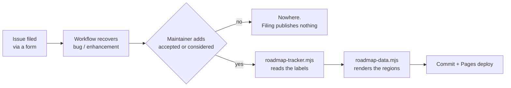

# Developing Tippani, and forking it

Two things shape everything else, so they come before the setup commands:

- **The whole app ships as one static Go binary with the frontend embedded.** There is no
  Node at runtime, no separate API process, no reverse proxy required. `web/dist/` is a
  committed build artefact embedded by `web/embed.go`, which is unusual and deliberate —
  it means `go build` alone produces something that runs.
- **CPU frugality is a requirement, not a preference.** The target is a NAS already
  running a hundred other things. No pollers, no timers, no background jobs. If a change
  needs something to wake up on its own, that is a design discussion before it is a patch.

## Which document answers what

Seven documents, seven questions. Each fact lives in exactly one of them and the others
link to it by name, because a summary is a copy that drifts more quietly than it fails.

| Document | The one question it answers |
| --- | --- |
| `README.md` | Should I run this, and how do I run it? |
| **`DEVELOPMENT.md`** (this file) | I want to change the code — where does it go, and how do I know it worked? |
| `docs/PLAN.md` | Why is it built this way, what was rejected, and what did I get wrong? |
| `docs/plans/*.md` | How will one specific unbuilt feature work? (Folded into `PLAN.md` and deleted once it ships — or once it is dropped.) |
| `docs/ui-glossary.html` | What is this bit of the interface called? |
| [`docs/roadmap.html`](https://aaronified.github.io/tippani/roadmap.html) | What is coming next? (generated — never hand-edited) |
| `AI.md` | How was this written, and what does that mean for trusting it? |
| `docs/troubleshoot.md` | The app logged a `TIP-*` code at me — what now? |

This file says **where and how**. PLAN says **why and why-not**: if you are about to write
a sentence explaining a design choice, it belongs there. AI.md states what verification
exists, as a claim about the repository — so AI.md carries the counts and this file
carries the commands, and neither should carry the other.

## Contents

- [What I will and will not merge](#what-i-will-and-will-not-merge)
- [Getting it running](#getting-it-running)
- [Where things live](#where-things-live)
- [Rules the code enforces that are easy to break](#rules-the-code-enforces-that-are-easy-to-break)
- [How the frontend and the backend meet](#how-the-frontend-and-the-backend-meet)
- [Common tasks](#common-tasks)
- [Tests](#tests)
- [Database changes](#database-changes)
- [Frontend build](#frontend-build)
- [Conventions](#conventions)
- [Sending a pull request](#sending-a-pull-request)
- [When your own build fails](#when-your-own-build-fails)
- [Maintainer: CI](#maintainer-ci)
- [Maintainer: the roadmap pipeline](#maintainer-the-roadmap-pipeline)
- [Maintainer: cutting a release](#maintainer-cutting-a-release)
- [Appendix: forking it as your own](#appendix-forking-it-as-your-own)

## What I will and will not merge

This section is first because it is the one that can save you a weekend.

**Open an issue before writing anything beyond a fix**, and read
[the roadmap](https://aaronified.github.io/tippani/roadmap.html) before you file — in
particular
[Considered and set aside](https://aaronified.github.io/tippani/roadmap.html#aside),
which lists what has been refused deliberately and why. A request from that list is still
welcome; it just needs the argument rather than the vote.

Refused on sight, with the reasoning on the roadmap or in `docs/PLAN.md`:

- **A new always-on dependency.** The Go side has three direct modules and the frontend
  has three runtime npm packages. A fourth needs a reason that survives being written down.
- **A background job, timer, poller or cron.** Cleanup and scheduling happen on a read.
  This is the frugality budget, and it is the constraint most features have to be
  redesigned around rather than argued out of.
- **Anything that phones home by default.** Every outbound call in this app is one the
  user triggered.
- **A config file.** Everything is an environment variable, on purpose.
- **A frontend state library.** `fetch` and `useState`, and a refetch signal passed down
  from `App.jsx`. This is a small app and it should keep reading like one.
- **Server-side OCR or speech, serving book files, and social features.** All four have
  entries under [Considered and set aside](https://aaronified.github.io/tippani/roadmap.html#aside).

And one that catches people out: **some of what looks like a bug is a decision**, written
up in `docs/PLAN.md`. The backup archive is keyed on your own credentials rather than a
built-in key, so a lost password really does lose the archive. The first highlight colour
cannot be named, because it is also what an import writes when the source gave no colour.
Read the decision before you fix the symptom.

## Getting it running

You need **Go** — the version on the `go` line in `go.mod` — and, only if you are
changing the frontend, **Node**, at whatever major version the `frontend` job in
`.github/workflows/ci.yml` installs. Both are stated in one place each on purpose; a
version number repeated in a document is a version number that goes stale.

```bash
git clone https://github.com/aaronified/tippani
cd tippani
make run                    # go run ./cmd/tippani serve  ->  http://localhost:8080
```

That works from a fresh clone with no frontend build, because `web/dist/` is committed.
The first account you create becomes the admin.

```bash
make build                  # static binary -> bin/tippani
make frontend               # npm install + vite build -> web/dist
make test                   # go test ./...
make run                    # run from source
make clean                  # bin/ and node_modules
```

`make build` sets `CGO_ENABLED=0` and stamps the version into
`internal/buildinfo.Version` via ldflags. Pass your own with `make build VERSION=v1.2.3`;
it defaults to `dev`, and a `dev` build reporting itself as `dev` in Settings is correct
rather than a bug.

Nothing is required to run — no API keys, no accounts, no outbound calls. Metadata
lookups are opt-in, and TMDB and TheTVDB do nothing at all without a key of your own.

Configuration is entirely environment variables, and **README's `## Configuration` is the
table** — it is not repeated here. One line it cannot give you, because it is a
development concern: the binary defaults to binding `127.0.0.1:8080`, and the Docker
image overrides that to `0.0.0.0:8080`. So local and container defaults differ, and a
test that assumes either one is wrong half the time.

## Where things live

The rule this map is written to, so that editing it keeps the altitude: **describe a
directory; name a file only when that file is the single place some rule is enforced.**
Where a directory holds interchangeable siblings — ten importers, thirty migrations,
forty test files — the pattern and the registration point are the useful facts, and
listing the siblings only guarantees the list is wrong on the eleventh.

`scripts/doc-map-check.mjs` keeps this honest: it fails CI if a path named here has
stopped existing, or if a new package, script or workflow has appeared that this section
never mentions. Run it yourself with `node scripts/doc-map-check.mjs`.

### The shape of a request

```text
browser ──▶ web/dist (embedded SPA)          ← everything not under /api
        └─▶ /api/* ──▶ internal/httpapi/server.go
                        ├── middleware: logging → gzip → security headers → CSRF
                        ├── *_handlers.go   the route group for this noun
                        └── internal/store  the only thing that opens SQLite
                                └── internal/search   FTS5 MATCH, escaped
                                    internal/importer parse an uploaded file
                                    internal/metadata the only outbound HTTP
```

### `cmd/` — the process

| Path | What it is |
| --- | --- |
| `cmd/tippani/main.go` | The entry point and the subcommand table: `serve`, `user add\|passwd\|del`, `healthcheck`, `version`. Reads every `TIPPANI_*` variable, opens and migrates the database, starts the server with graceful shutdown. **Where a new CLI verb goes.** |
| `cmd/tippani/tls.go` | Optional native HTTPS from a PEM pair, hot-reloaded when the files change so external renewal tooling needs no restart. |

### `internal/` — the packages

| Package | What it owns |
| --- | --- |
| `internal/httpapi/` | Every HTTP route, the middleware chain, and the request/response shapes. The largest package by far — see its own table below. |
| `internal/store/` | The SQLite connection, the pragmas, the migrations, the dedupe rules. **The only package that opens the database.** |
| `internal/search/` | Building safe FTS5 `MATCH` expressions, and the typo-correction pass. |
| `internal/importer/` | One parser per source format, producing the package's shared intermediate shapes. Touches no database. |
| `internal/metadata/` | Every outbound HTTP call in the app: Google Books, Open Library, TMDB, TheTVDB, Wikidata, Amazon, plus the SSRF-guarded image fetcher. |
| `internal/auth/` | Password hashing, cookie sessions, bearer device tokens, and the login rate limiter. |
| `internal/olog/` | Operational logging, and the registry of stable `TIP-*` operator codes. |
| `internal/updater/` | The in-app self-update: the GitHub release check, and the Docker Engine calls that pull and recreate. |
| `internal/changelog/` | The release history, embedded and parsed. Holds a **copy** of the root `CHANGELOG.md` because `//go:embed` cannot reach outside its own package; a drift test fails when the two differ. |
| `internal/buildinfo/` | The running build's identity — version from ldflags, plus the repo and image the update check queries. Three constants a fork overrides. |

#### `internal/httpapi/` — the convention, then the files that carry rules

Flat, and by a wide margin the largest package — which is why there is no per-file map of
it here and should not be one. The convention instead: **`*_handlers.go` is a route group
named for its noun; a bare noun is a shared shape or a helper.** A new endpoint joins the
nearest existing group, and only earns a file of its own when it is a new noun.

Six of them are not route groups but rules, and these are the ones worth knowing:

| File | The rule it holds |
| --- | --- |
| `server.go` | The route table and the middleware chain. Where auth and CSRF wrap the mux, and where every shared handler helper lives. Start here. |
| `quote.go` | **The shared shape of a quote** across all three kinds, plus the colour vocabulary and its validators. Change it and every export, search result and import path changes with it. |
| `import_staging.go` | The pending queue. **No import writes to the library directly** — everything lands here and is approved out. |
| `backup_crypto.go` | The AES-256-GCM archive envelope, and the rule that its key comes from a secret the operator knows rather than one stored beside it. |
| `capture_fields.go` | What an offline capture must set on create — `noted_at` and `source` — so a queued phone capture keeps its real date. |
| `locformula.go` | The location arithmetic over free-text locators (`p.142`, `610-612`, `42%`, `01:02:03`) that bulk staging edits use. |

The route groups themselves, so you can find the noun you want:

| Group | Endpoints for |
| --- | --- |
| `auth_handlers.go` | Login, logout, signup and first-run, password change, `/auth/me` and preferences. |
| `annotation_handlers.go` · `dialogue_handlers.go` · `utterance_handlers.go` | The three kinds of quote: book highlight, screen line, and standalone. |
| `book_handlers.go` · `movie_handlers.go` | The two kinds of work. Films and shows share one table, split by `media_type`. |
| `people_handlers.go` · `portrait_handlers.go` | Credited people — bios, external links, and pinning a person to a stable external id so a re-fetch cannot drift to a namesake. |
| `search_handler.go` | The FTS5 search across all five content tables, with facets and the zero-hit fuzzy pass. |
| `review_handlers.go` | The spaced-repetition engine: both decks, the grading path, the interval ladder. |
| `review_questions.go` | The one place the deck repertoire rules live: which question types a deck may ask, and the three that stop a reader configuring it into something that can ask them nothing. Mirrored client-side in `web/frontend/src/quiz.js`, which a test keeps in step by reading this file. |
| `shelf.go` · `read_history_handlers.go` | Shelf status, the legal transitions, and the read log. |
| `stats_handlers.go` | Everything the Stats page draws. |
| `export_handlers.go` · `export_quotes.go` | Markdown export per work and for the whole library, and the standalone-quote `type:`. |
| `import_handlers.go` · `import_quotes.go` · `import_movies.go` · `import_staged_bulk.go` · `import_dupes.go` | Upload, stage, bulk-edit and de-duplicate. |
| `metadata_handlers.go` · `metadata_library.go` · `metadata_bulk.go` · `lookup_handlers.go` · `reverify_handlers.go` | Source keys, the coverage console, bulk correction, one-off lookups, and the preview-then-apply re-verify flow. |
| `covers_handler.go` · `avatar_handlers.go` · `sticker_handlers.go` | The three image kinds, all under `<DataDir>/MediaCover`. |
| `taxonomy_handlers.go` | Tags and genres, and the starter vocabulary seeded per account. |
| `seed_stickers.go` · `assets/stickers/` | The five starter seals, embedded as SVG and copied into each account's own cover store — plus the one-shot backfill that hands them to accounts older than the feature. |
| `backup_handlers.go` · `backup_recovery.go` | Archive create, download and in-process restore; the per-instance recovery key. |
| `admin_handlers.go` · `maintenance_handlers.go` · `update_handlers.go` | User management, FTS rebuild and factory reset, and the self-updater. |
| `pairing_handlers.go` · `capabilities_handler.go` · `share_handlers.go` | Phone pairing by QR, the client version handshake, and one-shot share-image downloads. |
| `bulk_handlers.go` · `paging.go` · `gzip.go` | Bulk tagging, shared `LIMIT`/`OFFSET`, and response compression. |

#### `internal/store/`

| File | What it is |
| --- | --- |
| `store.go` | Opens the connection with this project's pragmas and pool settings. |
| `migrate.go` | The migration runner. Applies embedded `migrations/*.sql` newer than the recorded schema version, one transaction each, and **refuses to open a database from a newer build**. |
| `migrations/` | Numbered, embedded, append-only SQL. `NNNN_what_it_does.sql`. Never edit one that has shipped. |
| `hash.go` | **The dedupe rules** for all three quote kinds, and the text normalisation — punctuation folding, case, whitespace — that defines what "the same words" means. |
| `repair.go` | `quick_check` on boot, per-index FTS rebuild, recovery-from-content, and the factory reset. |
| `backup.go` | The `VACUUM INTO` snapshot and the close/reopen pair a file swap needs. |
| `settings.go` | The key-value settings table, which is where in-app metadata keys live. |

#### `internal/search/`

| File | What it is |
| --- | --- |
| `fts.go` | **The only sanctioned way user input reaches an FTS5 `MATCH`.** The highest-value grep target in the repository. |
| `correct.go` | Bounded typo correction against the indexed vocabulary, for the zero-hit pass. |
| `levenshtein.go` | Bounded edit distance with early abandon, plus a prefix mode for typeahead. |

#### `internal/importer/`, `internal/metadata/`, `internal/auth/`, and the small ones

`internal/importer/` holds one parser per source format, all the same shape — Tippani and
Readest markdown, catalogue markdown, standalone-quote markdown, Kindle
`My Clippings.txt`, Bookcision, a saved Amazon notebook page, Goodreads, Hardcover,
IMDb. **To add one:**
write the parser, register it in `importer.go`, put a fixture in `testdata/`, and copy
the nearest neighbour. `movie_markdown.go` additionally owns the three-way routing that
decides which parser an uploaded file reaches.

`internal/metadata/` is the same pattern for outbound calls: `metadata.go` holds the
shared HTTP plumbing — descriptive User-Agent, timeout, body-size limits — and each
provider is a file beside it. `covers.go` is the SSRF-guarded image fetcher and is worth
reading before you add anything that downloads a URL. `credits.go` splits a joined credit
("Gaiman & Pratchett") at read time, never by rewriting what was stored.

`internal/auth/` is two files: `auth.go` (bcrypt, cookie sessions, device tokens) and
`ratelimit.go` (an in-memory token bucket keyed `ip|username`).

`internal/olog/codes.go` is the registry of `TIP-<SUBSYS>-<NNN>` codes, and a test keeps
it in lockstep with `docs/troubleshoot.md` — add a code and you add a row.

### `web/` — the frontend

| Path | What it is |
| --- | --- |
| `web/embed.go` | `//go:embed all:dist`. The one line that makes the binary self-contained. |
| `web/dist/` | The built SPA. **A committed build artefact** — rebuild and commit it whenever you change the frontend. |
| `web/frontend/index.html` | The SPA shell, carrying an absolute `og:image`. |
| `web/frontend/public/` | The manifest, the icon set, and the two SVG marks. Copied verbatim into `dist/`. |
| `web/frontend/vite.config.js` | Builds into `../dist` and proxies `/api` during development. |
| `web/frontend/package.json` | Dependencies, and the five scripts everything else calls. |

`web/frontend/src/` is flat too, and the naming carries the distinction:
**TitleCase `*.jsx` are routed screens, lowercase modules are shared.** The screens are
`Home`, `Library`, `Movies`, `Quotes`, `SearchPage`, `AddSurface`, `ImportPage`,
`StagingPage`, `TagsPage`, `MetadataPage`, `StatsPage`, `Settings`, `Account`,
`WorkDetails`, `CoverPicker`, `ReverifyReview` — each is what its name says, and none of
them needs a row here.

The shared modules do:

| File | What it is |
| --- | --- |
| `main.jsx` | Boot. Applies theme, colours and label density **before the first paint**, so a phone never shows one frame of the wrong thing. |
| `App.jsx` | The auth gate and the app shell — top bar, phone drawer, bottom bar — and the only file that knows the full screen list. Two props go almost everywhere: `onAdd` opens the ＋ Add surface aimed at the current page, and `dataNonce` is the refetch signal. |
| `routes.js` | **The URL contract.** Pure functions, no React, so they are testable without rendering. Holds four hand-maintained nav lists of the same tab keys; `routes.test.js` asserts they agree, because a tab once got added to three of them. |
| `api.js` | The whole server surface in one small file: URL prefixing, the four request helpers, cover URLs, and the demo flag. |
| `ui.jsx` | The shared component library — every card, control, icon, overlay and hook the screens are assembled from. Large, and imported by everything. |
| `works.jsx` | What books and films share: the shelf vocabulary, work cards, hero headers, grouping. |
| `people.jsx` | Credit splitting, the name→metadata cache, portraits, and the person modal. |
| `theme.js` | The two aesthetics × light/dark, the accent, label density, and the six nameable colour categories, written onto `<html>` as data attributes and custom properties. |
| `help.jsx` | The per-screen copy registry behind every `?`. A test asserts every reachable screen has an entry. |
| `tour.jsx` | The first-launch guided tour, replayable from Settings. |
| `share.jsx` · `quoteImage.js` | The share sheet, and rendering a quote to PNG on a 2D canvas in the current styling. |
| `stickers.jsx` · `flow.jsx` | The sticker library, and the layer that flows quote text around a dragged sticker while keeping it real selectable DOM. |
| `undo.jsx` | One delete-with-Undo helper, so the seven screens that delete something cannot each forget the offer. |
| `actions.jsx` | The one list of what can be done to a quote, per kind, and where each action sits. Read by the card row, the ⋯ overflow and the bulk bar, so they cannot offer different sets. |
| `selection.jsx` · `SelectionBar.jsx` | Which cards are picked, and the sticky bar that acts on them. The hook drops ids that leave the visible list, so the count it reports is a count it can act on. |
| `greetings.js` · `epigraphs.js` | The two pools of bundled copy — Home’s greeting and the login screen’s epigraph — each with a rule about what may go in it. |
| `secret.js` | Password and passphrase rules, plus the backup header layout — **parsed by fixed byte offset against a Go-defined struct**, so the two must change together. |
| `greetings.js` | The date line and greeting on Home, from the device's own clock and zone. |
| `index.css` | The whole stylesheet: tokens, the paper/film material system, every component recipe the JSX names by class, and the mobile layout. |
| `textures/` | Six grayscale WebP tiles (paper, wood, metal, glass, fabric, rubber). |
| `demo/install.js` | **The demo shim.** Replaces `window.fetch` with a router over in-memory fixtures so the Pages build runs with no backend. It must mirror real handler response shapes; when it drifts, the demo renders nonsense rather than failing. |

### The test tree

| Path | What it is |
| --- | --- |
| `internal/**/*_test.go` | The Go suite, beside the code it tests. Real handlers, real SQLite, no mocks. |
| `internal/httpapi/crud_test.go` | Holds `newTestServer(t)` — the harness almost every handler test starts from. |
| `internal/importer/testdata/` | Fixture files, one per format. Real exports, trimmed. |
| `web/frontend/test/pure/` | Value-in, value-out tests. Node environment, no DOM, fast. |
| `web/frontend/test/dom/` | Component tests. jsdom, and only where a component is genuinely under test. |
| `web/frontend/vitest.config.js` | Defines those two projects, pins `TZ=UTC`, and exports `TIPPANI_SRC` for the few tests that read a source file rather than import it. |
| `web/frontend/test/setup-pure.js` | One shim: `window.matchMedia`, because `theme.js` calls it at module scope. |
| `web/frontend/test/setup-dom.js` | Everything jsdom lacks or answers uselessly, and the per-test reset. |

### `scripts/` — plain Node, no dependencies

| File | What it does |
| --- | --- |
| `roadmap-data.mjs` | Renders `docs/data/*.json` into the marked regions of `docs/roadmap.html`. Backs up first, and refuses to write a page that fails verification. |
| `roadmap-tracker.mjs` | Reads the issue tracker through `gh` into `docs/data/tracker.json`, so the renderer needs no network. |
| `glossary-css.mjs` | Refreshes the built stylesheet that `docs/ui-glossary.html` inlines, so its samples are styled by the rules the app ships. |
| `site-links.mjs` | Walks an assembled `_site/` and fails on any local `href` or `src` that does not resolve. |
| `seed-issues.mjs` | Backfills a GitHub issue per roadmap item that predates the automation. |
| `doc-map-check.mjs` | Checks this document against the tree: every path it names must exist, and every package, script and workflow must be named somewhere in it. |

### `.github/`

| File | What it does |
| --- | --- |
| `workflows/ci.yml` | The push and PR gate. Four jobs: `go`, `race`, `frontend`, `roadmap`. |
| `workflows/roadmap-bugs.yml` | On every issue event, rebuilds the tracker snapshot, re-renders the roadmap, and commits if anything moved. |
| `workflows/pages.yml` | Builds the demo and assembles the published site around it. |
| `workflows/release.yml` | Cuts the GitHub Release on a `v*` tag from that version's changelog section. |
| `workflows/docker-publish.yml` | Builds the multi-arch image and pushes to GHCR. Decides which image tags may move. |
| `ISSUE_TEMPLATE/` | The two issue forms and the no-blank-issues config that feed the roadmap pipeline. |

### `docs/` and the root

| Path | What it is |
| --- | --- |
| `docs/PLAN.md` | The decision log — every design decision, its reasoning, and the reversals. |
| `docs/plans/*.md` | One file per designed-but-unbuilt feature, and nothing else — see its README. A shipped plan is folded into `docs/PLAN.md`, with a pass on what it got wrong, and deleted here; the directory is a list of what is coming, never an archive. The first three (the bin, context menus and multiselect, search facets) retired at 1.14.2, three more at 1.15.0, and speaker discovery at 1.16.0. Three more retired the other way in 1.16.0 — half shipped, the rest dropped with their roadmap sections — which is the directory’s second exit and is recorded in its README. |
| `docs/roadmap.html` · `docs/roadmap.backup.html` | The published roadmap, and its last known-good copy. Generated regions — do not hand-edit between the markers. |
| `docs/ui-glossary.html` | Every part of the interface, named and rendered live in all four theme combinations. |
| `docs/landing.html` | The published site's front page. Carries absolute canonical and social URLs. |
| `docs/troubleshoot.md` | One row per `TIP-*` code. |
| `docs/data/` | The roadmap's four JSON files. `tracker.json` is generated; `bugs.json` and `features.json` are hand-written prose; `issue-map.json` maps a section slug to its issue. |
| `docs/img/` | The README screenshots. |
| `Makefile` · `Dockerfile` · `docker-compose.yml` | Build, image, and the shipped self-hosting default. |
| `deploy/` | A systemd unit and a Caddy example, for running the binary without Docker. |
| `.gitattributes` | **Normalises every text file to LF.** Read its comments before overriding `core.eol` on Windows — see [When your own build fails](#when-your-own-build-fails). |

Committed that you might not expect: `web/dist/`, `docs/roadmap.html`,
`docs/ui-glossary.html`. Ignored: `bin/`, `node_modules/`, `data/`, `_site/`.

## Rules the code enforces that are easy to break

Each of these is stated as an **absence** — the thing that must never appear — because
that is the part you cannot infer by reading the code around it.

- **Per-user isolation is a security property, not a filter.** Every query is scoped by
  `user_id`, and a row belonging to someone else answers `404`, never `403` — a `403`
  would confirm the row exists. New handler: scope it, and add the test that proves a
  second user gets `404`.
- **User input never reaches an FTS5 `MATCH` un-escaped.** `internal/search/fts.go` is
  the only place that builds one. A quote mark in a search box should find quotes, not
  raise an error.
- **An import never writes to the library.** Everything goes through
  `internal/httpapi/import_staging.go` and is approved out of the queue. Staging is what
  makes an importer safe enough to offer at all.
- **A shipped migration is never edited.** Forward-only, append-only, one transaction
  each. Someone is already running it.
- **A read-only transaction says so.** See [Database changes](#database-changes) — the
  `_txlock=immediate` consequence is that an unmarked transaction takes the write lock
  and serialises against real writers for nothing.
- **No goroutine outlives its request.** There is no worker pool, no ticker and no
  scheduler in this codebase, and adding the first one is a design conversation.
- **Nothing outside `internal/metadata/` makes an outbound HTTP call**, and nothing
  outside `internal/store/` opens the database.
- **The demo shim mirrors real response shapes.** When `web/frontend/src/demo/install.js`
  drifts from a handler, the published demo does not fail — it renders something wrong,
  quietly, which is worse.

## How the frontend and the backend meet

**The API is mounted under `/api` so that the entire root path space belongs to
client-side routes.** Anything not matching `/api` is served from the embedded SPA, with
unknown paths falling back to `index.html` for the router to resolve. That is why adding
a top-level URL is a frontend change and not a server one.

Every response from `api.js` resolves to `{ ok, status, data }` — including failures, so
a caller reads `ok` rather than catching. Server errors are `{"error": "message"}`, and
the message is written to be shown to a person.

There are two credentials and they are not interchangeable. A browser carries a **cookie
session** and must therefore pass CSRF; a phone carries an
`Authorization: Bearer <device token>` and bypasses CSRF because it was never subject to
it. A request presenting a bearer header that is present but unusable **fails closed**
rather than falling through to the cookie.

In a Go test, `newTestServer(t)` in `internal/httpapi/crud_test.go` gives you a real
server over a real temporary database; sign in through it the way a browser would rather
than constructing a session by hand, because the middleware chain is part of what you are
testing.

## Common tasks

**Add an endpoint.** Write the handler in the `*_handlers.go` group that owns its noun →
register the route in `server.go` → scope every query by `user_id` → add a test in the
matching `*_test.go`, including the second-user `404` → if the frontend calls it, add the
helper to `api.js`.

**Add an import format.** Write the parser in `internal/importer/`, returning the shared
shapes from `importer.go` → register it there → add a fixture under
`internal/importer/testdata/` → add the routing in `movie_markdown.go` if it is a
markdown variant → add the upload branch in `import_handlers.go` → add the source card in
`ImportPage.jsx`.

**Add a migration.** Create `internal/store/migrations/NNNN_what_it_does.sql`, the next
number → it is embedded automatically → never edit it again → if it adds a column an
existing write path should populate, find every write site, because a column that exists
but is never written is worse than one that is absent.

**Add a user preference.** It goes in the `users.preferences` JSON blob, not a new column
→ read and write it through the `/auth/me` handlers in `auth_handlers.go` → apply it in
`theme.js` if it affects appearance → add the control to `Settings.jsx` → add its help
entry in `help.jsx`.

**Add a metadata provider.** New file in `internal/metadata/`, using the shared client in
`metadata.go` → map its response into the existing candidate/details shapes rather than
inventing new ones → fetch images only through `covers.go` → add its key to the settings
table via `settings.go` and its card to the Metadata sources section of `Settings.jsx`.

**Add a CLI subcommand.** The table in `cmd/tippani/main.go` is the whole of it.

**Add a screen.** New TitleCase `*.jsx` in `web/frontend/src/` → add the tab to
`routes.js` and to **all four** nav lists → add the case in `App.jsx` → add its `help.jsx`
entry → `routes.test.js` will fail if the nav lists disagree.

## Tests

```bash
go test ./...               # everything, Go side — the local bar
go test -race ./...         # the nightly sweep; needs a C toolchain
go test ./internal/store/ -run TestConcurrent -count=5    # one thing, repeatedly
go vet ./...

cd web/frontend && npm test          # the frontend suite (Vitest)
npx vitest --root web/frontend run test/dom/icons.test.jsx    # one file
```

The Go tests run against **real HTTP handlers and a real SQLite database** — there are no
mocks, and a test that needs one is usually a design smell. `-count=5` is worth reaching
for on anything concurrent; a race that shows up one run in four is still a race.

The frontend suite runs on **Vitest in two projects**: `pure` for value-in, value-out
logic in the node environment, and `dom` for components under jsdom, which is paid for
only where a component is genuinely under test. `TZ` is pinned to UTC because several
places call `toLocaleDateString` with an undefined locale and would otherwise pass here
and fail on a runner set to anything else. Its dependencies are **devDependencies only** —
the three runtime npm packages are a claim AI.md makes, and it has to stay true.

Two things to know before adding to it. The setup files exist because jsdom's silence is
worse than its absence: `getBoundingClientRect` returns all zeros, so Masonry packs
everything into column 0 and Tooltip never opens — wrong, with nothing thrown. And **a
passing new test is not evidence yet**: several written for this suite were later found
to assert nothing when the code was deliberately broken under them. Break your fix on
purpose and watch the test go red before you trust it.

`-race` needs `CGO_ENABLED=1` and a C compiler, which the rest of the build deliberately
does without (`CGO_ENABLED=0`, pure-Go SQLite) — so on a machine with no gcc it is a
thing you read in a CI log rather than run. Plain `go test ./...` is the local bar; if you
are changing anything that writes concurrently, push and read the race job before you call
it done.

**It runs in two halves, and the reason is worth knowing before you move it back.** The
whole suite under `-race` takes **29 minutes**, because pure-Go SQLite means the detector
instruments the entire database engine rather than only this repo's code —
`internal/httpapi` alone is 143 seconds unraced and about 29 minutes raced. So the five
locking tests (`conflict_pool_test.go`, `write_lock_test.go`) run raced on **every push**,
which is the coverage those files were written for and costs a couple of minutes, and the
full sweep runs **nightly at 03:00 UTC**. If you add a test that races, name it in the
`race` job's filter or it will not be raced until the following morning.

That job asserts each named test actually ran. A `-run` filter that matches nothing still
exits 0, and `ok (0 tests)` reads exactly like `ok` — a false green that has already cost
this repo an afternoon.

The bar for a change: `go vet` clean, `go test ./...` green, and **a test that would have
failed before your fix**. That last one is the one that matters. There is a worked example
in the repo — the concurrent-write `500` had a written-up cause and a written-up fix, and
both were wrong. What settled it was making the test fail on purpose and reading the
error code.

## Database changes

Migrations live in `internal/store/migrations/`, are embedded, numbered
`NNNN_what_it_does.sql`, and **append-only**. Each runs in its own transaction.

- Add a new file. Never edit a migration that has shipped — someone is already running it.
- SQLite via `modernc.org/sqlite`: pure Go, so `CGO_ENABLED=0` works and FTS5 is compiled
  in with no build tag.
- The connection is opened WAL, `synchronous=FULL`, `busy_timeout=5000`,
  `foreign_keys=ON`, and **`_txlock=immediate`**.

That last pragma is load-bearing and worth understanding before you touch `store.go`.
Almost every write here reads before it writes. Under SQLite's default `DEFERRED` locking
that makes `BEGIN` take a read lock which the first `INSERT` must upgrade — and SQLite
refuses to wait on that upgrade, because two transactions both holding read locks and
both wanting to write would deadlock. It fails the loser instantly, so `busy_timeout` is
never consulted. `IMMEDIATE` takes the write lock up front, where there is nothing to
upgrade.

The consequence for you: **a transaction that only reads should say so.**

```go
tx, err := s.Store.DB.BeginTx(ctx, &sql.TxOptions{ReadOnly: true})
```

Otherwise it takes the write lock and serialises against real writers for nothing.
`TestReadersOverlapAWriter` fails if reads ever start queueing behind writes.

## Frontend build

```bash
cd web/frontend
npm install
npm run dev                 # Vite dev server, proxying /api to 127.0.0.1:8080
npm run build               # -> ../../web/dist  (commit this)
npm run build:demo          # -> _site, the read-only demo with a fetch shim
```

Run `make run` in one terminal and `npm run dev` in another. Point the proxy elsewhere
with `TIPPANI_DEV_API`.

`web/dist/` is committed because the Go binary embeds it, so a frontend change is two
things in one commit: the source, and the rebuilt `dist`. If you change the frontend and
do not rebuild, the binary keeps serving the old UI and nothing will tell you — which is
why CI runs `git diff --exit-code -- web/dist` after building.

The demo build (`VITE_DEMO=1`) swaps in the dummy-data fetch shim and disables writes. It
is what GitHub Pages publishes.

For what a piece of the interface is *called* before you rename it,
[`docs/ui-glossary.html`](https://aaronified.github.io/tippani/ui-glossary.html) is the
canonical list. It is not repeated here.

## Conventions

**Commit messages are [Conventional Commits](https://www.conventionalcommits.org/):**
`fix:`, `feat:`, `docs:`, `refactor:`, `test:`, `chore:`. The subject says what changed;
the body says **why**, and why the obvious alternative was not chosen. Look at `git log` —
the bodies are long on purpose, because the reasoning is the part that cannot be recovered
from the diff later. One commit per fix and per feature; minor fixes may be clubbed.

**Comments explain why, not what.** The codebase is written that way, and a patch that
only restates its own code reads as a different author.

**Every UI label is five words or fewer.** Longer copy goes behind an info dot. This is a
house rule rather than a coincidence: a bubble that needs a paragraph is an info dot.

**Every document in this repo speaks in the first person** — "I", not "we" and not "the
maintainer".

**Documents that go stale with a change**, and are expected in the same pull request:
`CHANGELOG.md` for anything user-visible, `docs/ui-glossary.html` for anything the
interface is named by, `AI.md` if you change how the repo is checked, and `docs/PLAN.md`
if you depart from the design — recorded as a departure, with the reasoning, rather than
silently.

## Sending a pull request

1. **Open an issue first** for anything beyond a fix. See
   [What I will and will not merge](#what-i-will-and-will-not-merge).
2. **Branch off `main`.** Keep it to one concern.
3. **Write the commit message body.** The why, and the alternative you rejected.
4. **`go vet ./...` and `go test ./...` must pass**, `npm test` if you touched the
   frontend, and a frontend change must include the rebuilt `web/dist/`.
5. **Update the docs that go stale** — the list is in [Conventions](#conventions).

## When your own build fails

Four failures that are self-inflicted rather than real, in the order they catch people:

- **`git diff --exit-code -- web/dist` fails and the diff is whitespace.** Line endings.
  `.gitattributes` normalises every text file to LF, and overriding `core.eol` or
  `core.autocrlf` locally defeats it. Read the comments in that file before changing
  anything there.
- **A Go test passes suspiciously fast.** Check the `-run` filter matched something. A
  filter that matches nothing exits 0 and prints `ok`.
- **`node scripts/glossary-css.mjs --check` fails.** The stylesheet inlined into
  `docs/ui-glossary.html` is generated from the built app CSS. Run `make frontend`, then
  `node scripts/glossary-css.mjs` — do not hand-edit the `<style>` block.
- **`node scripts/roadmap-data.mjs --check` fails.** The page has drifted from
  `docs/data/*.json`. Run the script without `--check`. Never edit the page between the
  `ROADMAP:*` markers.
- **The app logged a `TIP-*` code.** `docs/troubleshoot.md` has a row per code.

## Maintainer: CI

`.github/workflows/ci.yml` runs on push and pull request, plus a 03:00 UTC schedule, in
four jobs:

| Job | What it runs |
| --- | --- |
| `go` | `go vet`, the full Go suite, and a smoke test that boots the server and health-checks it. |
| `race` | The five locking tests under `-race` on every push, and the whole suite on the nightly schedule. Asserts each named test actually ran. |
| `frontend` | `npm test`, `npm run build`, and `git diff --exit-code -- web/dist`. |
| `roadmap` | `roadmap-data.mjs --check`, `glossary-css.mjs --check`, and `doc-map-check.mjs`. |

The other four workflows are described in [`.github/`](#github) above.

## Maintainer: the roadmap pipeline

Worth understanding even if you never touch it, because it explains why editing
`docs/roadmap.html` between the marker comments does not stick.

The roadmap is a single self-contained HTML file with **no script in it**, so anything
dynamic has to be baked in at commit time rather than fetched at view time. Six marked
regions are generated; everything outside them is hand-written prose.



The rule in one sentence: **the labels decide what is on the page, and the repo only
decides how it reads.**

| File | Owner | Contains |
| --- | --- | --- |
| `docs/data/tracker.json` | Generated | The tracker's state. Never edit it |
| `docs/data/bugs.json` | You | Per-issue prose `overrides` for bugs |
| `docs/data/features.json` | You | Per-issue prose `overrides` for requests |
| `docs/data/issue-map.json` | Tooling | Section slug to issue number |

```bash
node scripts/roadmap-tracker.mjs   # read the tracker (needs gh, and auth)
node scripts/roadmap-data.mjs      # render the page
node scripts/roadmap-data.mjs --check     # CI: fail if the page is stale
node scripts/roadmap-data.mjs --restore   # put docs/roadmap.backup.html back
node scripts/seed-issues.mjs       # file an issue per existing roadmap item (dry run)
```

Three things keep it from going wrong: every write keeps the previous page in
`docs/roadmap.backup.html`; a render that loses a marker, unbalances `<details>` or
shrinks the page implausibly is refused rather than published; and CI fails if the
committed page has drifted from its data files.

Issue text is escaped before it goes anywhere near the page, fenced code blocks are
dropped rather than rendered, and only paragraphs, list items and `code` spans are
emitted. An issue cannot inject markup. That is also why the `accepted` gate exists —
escaping stops markup, and does nothing about a report that is simply wrong.

One rule for editing the page by hand: **a section's § number is its position and moves
whenever the order does.** Cite the issue number, never the §. Anchors are content slugs
(`#mobile-pwa`) for the same reason, and `issue-map.json` is keyed on them.

## Maintainer: cutting a release

Releases are tag-driven. There is no version constant to bump: it is stamped from the tag.

1. In `CHANGELOG.md`, rename `## [Unreleased]` to `## [X.Y.Z] - YYYY-MM-DD`. Match the
   house style of the entries above it: the user-visible symptom first, then the
   reasoning, then what was rejected.
2. Copy it into the binary: `cp CHANGELOG.md internal/changelog/CHANGELOG.md`.
   The app shows the EMBEDDED copy (`//go:embed` cannot reach the repo root), so a
   release that skips this ships the previous version's notes to everyone who opens
   Settings → Changelog. `make changelog` does it, and the drift test in
   `internal/changelog` fails the build if you forget — this step is the reminder,
   not the guarantee.
3. Commit as `chore(release): X.Y.Z`.
4. Tag and push — **the tag by name, never `--tags`**:

   ```bash
   git tag vX.Y.Z
   git push origin main
   git push origin vX.Y.Z
   ```

   `--tags` pushes every tag in the local repository, and `--follow-tags` pushes every
   annotated tag reachable from the commit — which is all of them. Either will quietly
   publish a tag made weeks ago and never pushed, firing its whole release pipeline
   alongside the one I meant. That is not hypothetical: on 2026-08-09 an orphaned
   `v1.3.0` went up beside `v1.7.2`, built more slowly, finished second, and took
   `:latest` with it. Naming the tag pushes exactly one thing.
5. Watch it land: `gh run list --limit 5`, and check the release page and the GHCR tags.

`release.yml` cuts the GitHub Release using that version's changelog section as the notes,
and `docker-publish.yml` builds and pushes the GHCR image on the same tag. Both are also
runnable by hand against an existing tag to backfill a missed release:

```bash
gh workflow run release.yml --ref vX.Y.Z
```

`docker-publish.yml` decides which image tags may *move*: `X.Y.Z` is always published,
but `latest` and `X.Y` are claimed only by the highest-ranked tag, computed from the tag
list rather than from build order. And the binary refuses to open a database whose schema
version is above the newest migration it carries — so a downgrade stops with both numbers
in the message instead of starting up blind to every table added since.

Version numbers follow [Semantic Versioning](https://semver.org/). A migration that
changes existing data, or anything that alters an export format, deserves a minor bump and
a paragraph in the changelog saying what to expect — people are self-hosting this, and an
upgrade that surprises them is worse than one that waits a week.

## Appendix: forking it as your own

Nothing here assumes you are me, but a handful of strings do. In rough order of how much
they matter:

1. **Module path.** `go.mod` declares `module tippani`, and every internal import is
   `tippani/internal/...`. Renaming it is a find-and-replace across the tree:

   ```bash
   grep -rl 'tippani/internal' --include='*.go' . | xargs sed -i 's#tippani/internal#yourname/internal#g'
   sed -i 's#^module tippani#module yourname#' go.mod
   ```

   Leaving it alone is entirely fine and costs nothing.
2. **Update check and image.** `internal/buildinfo/buildinfo.go` defaults to
   `aaronified/tippani` and `ghcr.io/aaronified/tippani`. You do not need to edit the code:
   set `TIPPANI_REPO` and `TIPPANI_IMAGE`. Do set them, or your fork's in-app updater will
   offer people my releases.
3. **Published docs base.** `DOCS_BASE` in `web/frontend/src/Settings.jsx` points at
   `https://aaronified.github.io/tippani/`. The roadmap and UI glossary are not embedded in
   the binary, so a self-hosted instance links out to a published copy.
4. **The published site's own URLs.** `docs/landing.html` carries an absolute `canonical`,
   `og:url` and `og:image`, and `web/frontend/index.html` carries an absolute `og:image` —
   all four must be absolute or they are ignored, so none of them can be made relative. The
   `base` in `.github/workflows/pages.yml` builds `robots.txt` and `sitemap.xml` from the
   same value. Point them at your fork's Pages URL, or your social previews advertise mine.
5. **Roadmap tooling.** `REPO` in `scripts/roadmap-data.mjs`, and the `GITHUB_REPOSITORY`
   fallback in `scripts/roadmap-tracker.mjs` and `scripts/seed-issues.mjs`. In Actions the
   environment supplies it; locally the fallback is used.
6. **Issue forms and links.** `.github/ISSUE_TEMPLATE/*.yml` and the URLs in
   `docs/roadmap.html` and `README.md`.
7. **Metadata user agent.** `internal/metadata/metadata.go` identifies itself to the
   metadata providers. Change it — it is how they contact you about your traffic, not mine.
8. **`docker-compose.yml`** references the image name.

To get the roadmap automation working on a fork you also need the labels it depends on,
because a label that does not exist is silently not applied:

```bash
gh label create roadmap    --color B4482D --description "Planned work, written up on the roadmap"
gh label create considered --color BE8A4E --description "Being considered, not committed"
gh label create accepted   --color 3E8E5A --description "Accepted; appears on the roadmap"
```

`bug`, `enhancement`, `duplicate` and `wontfix` already exist in a new GitHub repository.

Then enable Pages (Settings → Pages → Source: GitHub Actions; `pages.yml` also does this
itself on first run), and check that Actions has write permission for contents so the
roadmap workflow can commit.
