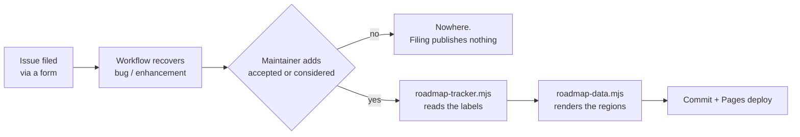

# Developing Tippani, and forking it

This is the practical companion to [`docs/PLAN.md`](docs/PLAN.md). PLAN says what the app
is and why it is shaped that way; this file says how to build it, how to change it, and
what to rename if you want it to be yours instead of mine.

Two things worth knowing before you start, because they shape everything else:

- **The whole app ships as one static Go binary with the frontend embedded.** There is no
  Node at runtime, no separate API process, no reverse proxy required. `web/dist/` is a
  committed build artefact embedded with `go:embed`, which is unusual and deliberate — it
  means `go build` alone produces something that runs.
- **CPU frugality is a requirement, not a preference.** The target is a NAS already
  running a hundred other things. No pollers, no timers, no background jobs. If a change
  needs something to wake up on its own, that is a design discussion before it is a patch.

## Contents

- [Getting it running](#getting-it-running)
- [The layout](#the-layout)
- [Tests](#tests)
- [Database changes](#database-changes)
- [Frontend](#frontend)
- [Sending a pull request](#sending-a-pull-request)
- [Forking it as your own](#forking-it-as-your-own)
- [The roadmap pipeline](#the-roadmap-pipeline)
- [Cutting a release](#cutting-a-release)

## Getting it running

You need **Go 1.26+**. You need **Node 22+** only if you are changing the frontend.

```bash
git clone https://github.com/aaronified/tippani
cd tippani
make run                    # go run ./cmd/tippani serve  -> http://localhost:8080
```

That works from a fresh clone with no frontend build, because `web/dist/` is committed.
The first account you create becomes the admin.

```bash
make build                  # static binary -> bin/tippani
make frontend               # npm install + vite build -> web/dist
make test                   # go test ./...
make clean                  # bin/ and node_modules
```

`make build` sets `CGO_ENABLED=0` and stamps the version into
`internal/buildinfo.Version` via ldflags. Pass your own with
`make build VERSION=v1.2.3`; it defaults to `dev`. A `dev` build reports itself as `dev`
in Settings, which is correct and not a bug.

Nothing is required to run — no API keys, no accounts, no outbound calls. Metadata
lookups are opt-in, and TMDB and TheTVDB do nothing at all without a key of your own.

### Configuration

Everything is an environment variable. There is no config file, on purpose.

| Variable | Default | What it does |
| --- | --- | --- |
| `TIPPANI_DATA` | `data` | Where the SQLite database, covers and backups live |
| `TIPPANI_BIND` | `127.0.0.1:8080` | Listen address. **Localhost-only by default** (PLAN §2) — set `0.0.0.0:8080` to reach it from the LAN |
| `TIPPANI_LOG_LEVEL` | `info` | `debug` gets you the verbose request log |
| `TIPPANI_TLS_CERT` / `_KEY` | unset | Hand it a PEM pair and it serves HTTPS itself, hot-reloaded |
| `TIPPANI_COOKIE_SECURE` | auto | Force the `Secure` cookie flag when behind a proxy that terminates TLS |
| `TIPPANI_TRUSTED_PROXY` | unset | Trust `X-Forwarded-For` from this source only |
| `TIPPANI_REPO` | `aaronified/tippani` | Repository the in-app update check queries |
| `TIPPANI_IMAGE` | `ghcr.io/aaronified/tippani` | Image the one-click updater pulls |
| `TIPPANI_DOCKER_SOCK` / `_HOST` | unset | Enables one-click update when the Docker socket is reachable |

The last three matter for forks — see [Forking it as your own](#forking-it-as-your-own).

## The layout

`README.md` has the full tree. The parts you are most likely to touch:

| Path | What lives there |
| --- | --- |
| `cmd/tippani/` | Entrypoint: `serve`, user subcommands, `healthcheck` |
| `internal/store/` | SQLite open and pragmas, embedded migrations, dedupe hashing |
| `internal/httpapi/` | Routes, CSRF, handlers, the shared quote shape, import staging |
| `internal/search/` | FTS5 MATCH escaping — never pass raw input to MATCH |
| `internal/importer/` | One parser per source format |
| `internal/metadata/` | Google Books, Open Library, TMDB, TheTVDB, Wikidata clients |
| `web/frontend/src/` | Vite + React 19 + Tailwind v4 |
| `web/dist/` | The built SPA, embedded. Commit it when you change the frontend |
| `docs/` | PLAN, the roadmap, the UI glossary, and the roadmap's data files |
| `scripts/` | Roadmap generator and issue tooling. Plain Node, no dependencies |

### Two rules the code enforces that are easy to break

- **Per-user isolation is a security property, not a filter.** Every query is scoped by
  `user_id`, and a row belonging to someone else answers `404` rather than `403` — a `403`
  would confirm the row exists. If you add a handler, scope it, and add the test that
  proves a second user gets `404`.
- **Never interpolate user input into an FTS5 `MATCH`.** Use the escaping in
  `internal/search/`. A quote mark in a search box should find quotes, not raise an error.

## Tests

```bash
go test ./...               # everything, Go side — the local bar
go test -race ./...         # the nightly sweep; needs a C toolchain
go test ./internal/store/ -run TestConcurrent -count=5    # one thing, repeatedly
go vet ./...

cd web/frontend && npm test  # the frontend suite (Vitest)
```

Over 500 Go test functions across 87 files. They run against **real HTTP handlers and a
real SQLite database** — there are no mocks, and a test that needs one is usually a
design smell. `-count=5` is worth reaching for on anything concurrent; a race that shows
up one run in four is still a race.

The frontend suite arrived in 1.5.0 and runs on **Vitest**, in two projects: a `node`
one for pure logic (no jsdom, near-zero cost) and a `jsdom` one for anything that
renders. `TZ` is pinned to UTC, because five places call `toLocaleDateString` and would
otherwise snapshot differently on CI. Its dependencies are **devDependencies only** —
the three runtime npm packages are a claim AI.md makes and it has to stay true.

Two things about it are worth knowing before you add to it. The `node` setup file shims
`window.matchMedia` because `theme.js` calls it at MODULE scope and throws on import;
the `jsdom` one additionally stubs `ResizeObserver`, `getBoundingClientRect` (jsdom
returns all zeros, so Masonry packs everything into column 0 and Tooltip never opens —
silently wrong, which is worse than a crash), `URL.createObjectURL` and `Image` (whose
`onload` never fires, so `loadFaceImages` hangs forever). And **a passing new test is
not evidence yet**: several written for this suite were found to assert nothing when the
code was deliberately broken under them. Break your fix on purpose and watch the test go
red before you trust it.

`-race` needs `CGO_ENABLED=1` and a C compiler, which the rest of the build deliberately
does without (`CGO_ENABLED=0`, pure-Go SQLite) — so on a machine with no gcc it is a
thing you read in a CI log rather than run. Plain `go test ./...` is the local bar; if
you are changing anything that writes concurrently, push and read the race job before you
call it done.

**It runs in two halves, and the reason is worth knowing before you move it back.** The
whole suite under `-race` takes **29 minutes**, because pure-Go SQLite means the detector
instruments the entire database engine rather than only this repo's code — `internal/httpapi`
alone is 143 seconds unraced and about 29 minutes raced. So the five locking tests
(`conflict_pool_test.go`, `write_lock_test.go`) run raced on **every push**, which is the
coverage those files were written for and costs a couple of minutes, and the full sweep
runs **nightly at 03:00 UTC**. If you add a test that races, name it in the `race` job's
filter or it will not be raced until the following morning.

That job asserts each named test actually ran. A `-run` filter that matches nothing still
exits 0, and `ok (0 tests)` reads exactly like `ok` — a false green that has already cost
this repo an afternoon.

The bar for a change: `go vet` clean, `go test ./...` green, and a test that would have
failed before your fix. That last one is the one that matters. There is a worked example
in the repo — the concurrent-write `500` had a written-up cause and a written-up fix, and
both were wrong. What settled it was making the test fail on purpose and reading the
error code.

CI runs `go vet`, `go test`, the locking tests under `-race` (and the whole suite nightly),
`npm test`, a smoke test that boots the server and health-checks it, the frontend build,
and a check that the roadmap's generated regions still match their data files.

It also runs `git diff --exit-code -- web/dist` after building the frontend. `web/dist`
is a committed build artifact embedded with `go:embed`, and before 1.5.0 nothing checked
that the committed copy matched the source — so a forgotten `make frontend` meant the
binary kept serving the old UI with nothing to say so.

## Database changes

Migrations live in `internal/store/migrations/`, are embedded, numbered, and
**append-only**. Each runs in its own transaction.

- Add a new file, `NNNN_what_it_does.sql`. Never edit a migration that has shipped —
  someone is already running it.
- SQLite via `modernc.org/sqlite`: pure Go, so `CGO_ENABLED=0` works and FTS5 is compiled
  in with no build tag.
- The connection is opened WAL, `synchronous=FULL`, `busy_timeout=5000`,
  `foreign_keys=ON`, and **`_txlock=immediate`**.

That last pragma is load-bearing and worth understanding before you touch `store.go`.
Almost every write here reads before it writes. Under SQLite's default `DEFERRED` locking
that makes `BEGIN` take a read lock which the first `INSERT` must upgrade — and SQLite
refuses to wait on that upgrade, because two transactions both holding read locks and
both wanting to write would deadlock. It fails the loser instantly, so `busy_timeout` is
never consulted. `IMMEDIATE` takes the write lock up front, where there is nothing to
upgrade.

The consequence for you: **a transaction that only reads should say so.**

```go
tx, err := s.Store.DB.BeginTx(ctx, &sql.TxOptions{ReadOnly: true})
```

Otherwise it takes the write lock and serialises against real writers for nothing.
`TestReadersOverlapAWriter` fails if reads ever start queueing behind writes.

## Frontend

```bash
cd web/frontend
npm install
npm run dev                 # Vite dev server, proxying /api to 127.0.0.1:8080
npm run build               # -> ../../web/dist  (commit this)
npm run build:demo          # -> _site, the read-only demo with a fetch shim
```

Run `make run` in one terminal and `npm run dev` in another. The dev server proxies
`/api` to `127.0.0.1:8080`; point it elsewhere with `TIPPANI_DEV_API`.

`web/dist/` is committed because the Go binary embeds it. So a frontend change is two
things in one commit: the source, and the rebuilt `dist`. If you change the frontend and
do not rebuild, the binary keeps serving the old UI and nothing will tell you.

The demo build (`VITE_DEMO=1`) swaps in a dummy-data fetch shim and disables writes. It is
what GitHub Pages publishes.

## Sending a pull request

1. **Open an issue first** for anything beyond a fix, and read
   [the roadmap](https://aaronified.github.io/tippani/roadmap.html) before you do —
   especially [Considered and set aside](https://aaronified.github.io/tippani/roadmap.html#aside),
   which lists things refused deliberately. A request from that list is still welcome, but
   it needs the argument rather than the vote.
2. **Branch off `main`.** Keep it to one concern.
3. **Commit messages are [Conventional Commits](https://www.conventionalcommits.org/):**
   `fix:`, `feat:`, `docs:`, `refactor:`, `test:`, `chore:`. The subject says what changed;
   the body says **why**, and why the obvious alternative was not chosen. Look at
   `git log` — the bodies are long on purpose, because the reasoning is the part that
   cannot be recovered from the diff later.
4. **`go vet ./...` and `go test ./...` must pass**, and a frontend change must include
   the rebuilt `web/dist/`.
5. **Update the docs that go stale.** `CHANGELOG.md` for anything user-visible,
   `AI.md` if you change how the repo is checked, and `docs/PLAN.md` if you depart from the
   design — recorded as a departure, with the reasoning, rather than silently.

What gets a change rejected, so you do not waste an afternoon: a new always-on dependency,
a background job or timer, anything that phones home by default, server-side OCR or
speech, serving book files, and social features. All of those are on the roadmap's
set-aside list with reasons.

Comments should explain **why**, not what. The codebase is written that way and a patch
that only restates its own code reads as a different author.

## Forking it as your own

Nothing here assumes you are me, but a handful of strings do. In rough order of how much
they matter:

1. **Module path.** `go.mod` declares `module tippani`, and every internal import is
   `tippani/internal/...`. Renaming it means a find-and-replace across the tree. Leaving
   it alone is entirely fine and costs nothing.
2. **Update check and image.** `internal/buildinfo/buildinfo.go` defaults to
   `aaronified/tippani` and `ghcr.io/aaronified/tippani`. You do not need to edit the code:
   set `TIPPANI_REPO` and `TIPPANI_IMAGE`. Do set them, or your fork's in-app updater will
   offer people my releases.
3. **Published docs base.** `DOCS_BASE` in `web/frontend/src/Settings.jsx` points at
   `https://aaronified.github.io/tippani/`. The roadmap and UI glossary are not embedded in
   the binary, so a self-hosted instance links out to a published copy.
4. **Roadmap tooling.** `REPO` in `scripts/roadmap-data.mjs`, and the `GITHUB_REPOSITORY`
   fallback in `scripts/roadmap-tracker.mjs` and `scripts/seed-issues.mjs`. In Actions the
   environment supplies it; locally the fallback is used.
5. **Issue forms and links.** `.github/ISSUE_TEMPLATE/*.yml` and the URLs in
   `docs/roadmap.html` and `README.md`.
6. **Metadata user agent.** `internal/metadata/metadata.go` identifies itself to the
   metadata providers. Change it — it is how they contact you about your traffic, not mine.
7. **`docker-compose.yml`** references the image name.

To get the roadmap automation working on a fork you also need the labels it depends on,
because a label that does not exist is silently not applied:

```bash
gh label create roadmap    --color B4482D --description "Planned work, written up on the roadmap"
gh label create considered --color BE8A4E --description "Being considered, not committed"
gh label create accepted   --color 3E8E5A --description "Accepted; appears on the roadmap"
```

`bug`, `enhancement`, `duplicate` and `wontfix` already exist in a new GitHub repository.

Then enable Pages (Settings → Pages → Source: GitHub Actions; `pages.yml` also does this
itself on first run), and check that Actions has write permission for contents so the
roadmap workflow can commit.

## The roadmap pipeline

Worth understanding even if you never touch it, because it explains why editing
`docs/roadmap.html` between the marker comments does not stick.

The roadmap is a single self-contained HTML file with **no script in it**, so anything
dynamic has to be baked in at commit time rather than fetched at view time. Six marked
regions are generated; everything outside them is hand-written prose.



The rule in one sentence: **the labels decide what is on the page, and the repo only
decides how it reads.**

| File | Owner | Contains |
| --- | --- | --- |
| `docs/data/tracker.json` | Generated | The tracker's state. Never edit it |
| `docs/data/bugs.json` | You | Per-issue prose `overrides` for bugs |
| `docs/data/features.json` | You | Per-issue prose `overrides` for requests |
| `docs/data/issue-map.json` | Tooling | Roadmap anchor to issue number |

```bash
node scripts/roadmap-tracker.mjs   # read the tracker (needs gh, and auth)
node scripts/roadmap-data.mjs      # render the page
node scripts/roadmap-data.mjs --check     # CI: fail if the page is stale
node scripts/roadmap-data.mjs --restore   # put docs/roadmap.backup.html back
node scripts/seed-issues.mjs       # file an issue per existing roadmap item (dry run)
```

Three things that keep it from going wrong: every write keeps the previous page in
`docs/roadmap.backup.html`; a render that loses a marker, unbalances `<details>` or
shrinks the page implausibly is refused rather than published; and CI fails if the
committed page has drifted from its data files.

Issue text is escaped before it goes anywhere near the page, fenced code blocks are
dropped rather than rendered, and only paragraphs, list items and `code` spans are
emitted. An issue cannot inject markup. That is also why the `accepted` gate exists —
escaping stops markup, and does nothing about a report that is simply wrong.

## Cutting a release

Releases are tag-driven. There is no version constant to bump: it is stamped from the tag.

1. In `CHANGELOG.md`, rename `## [Unreleased]` to `## [X.Y.Z] - YYYY-MM-DD`.
2. Commit as `chore(release): X.Y.Z`.
3. Tag and push — **the tag by name, never `--tags`**:

   ```bash
   git tag vX.Y.Z
   git push origin main
   git push origin vX.Y.Z
   ```

   `--tags` pushes every tag in the local repository, and `--follow-tags` pushes every
   annotated tag reachable from the commit — which is all of them. Either will quietly
   publish a tag made weeks ago and never pushed, firing its whole release pipeline
   alongside the one I meant. That is not hypothetical: on 2026-08-09 an orphaned
   `v1.3.0` went up beside `v1.7.2`, built more slowly, finished second, and took
   `:latest` with it. Naming the tag pushes exactly one thing.

`release.yml` cuts the GitHub Release using that version's changelog section as the notes,
and `docker-publish.yml` builds and pushes the GHCR image on the same tag. Both are also
runnable by hand against an existing tag to backfill a missed release.

`docker-publish.yml` decides which image tags may *move*: `X.Y.Z` is always published,
but `latest` and `X.Y` are claimed only by the highest-ranked tag, computed from the tag
list rather than from build order. And the binary refuses to open a database whose schema
version is above the newest migration it carries — so a downgrade stops with both numbers
in the message instead of starting up blind to every table added since.

Version numbers follow [Semantic Versioning](https://semver.org/). A migration that
changes existing data, or anything that alters an export format, deserves a minor bump and
a paragraph in the changelog saying what to expect — people are self-hosting this, and an
upgrade that surprises them is worse than one that waits a week.
