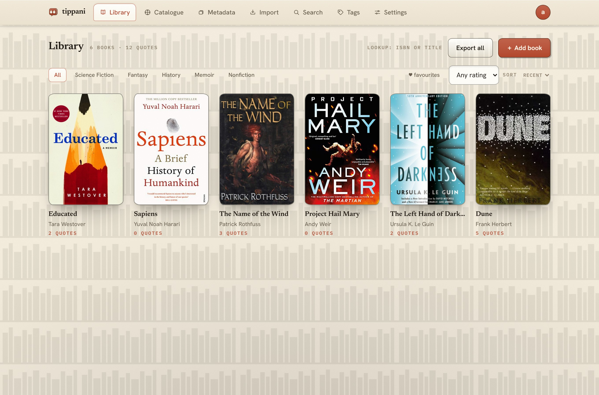
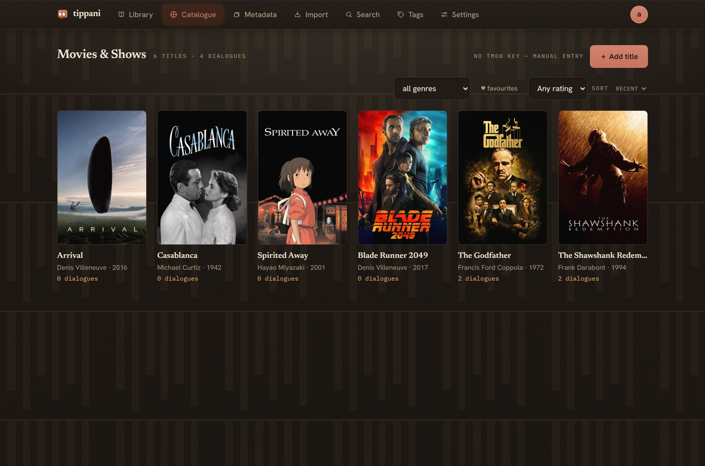
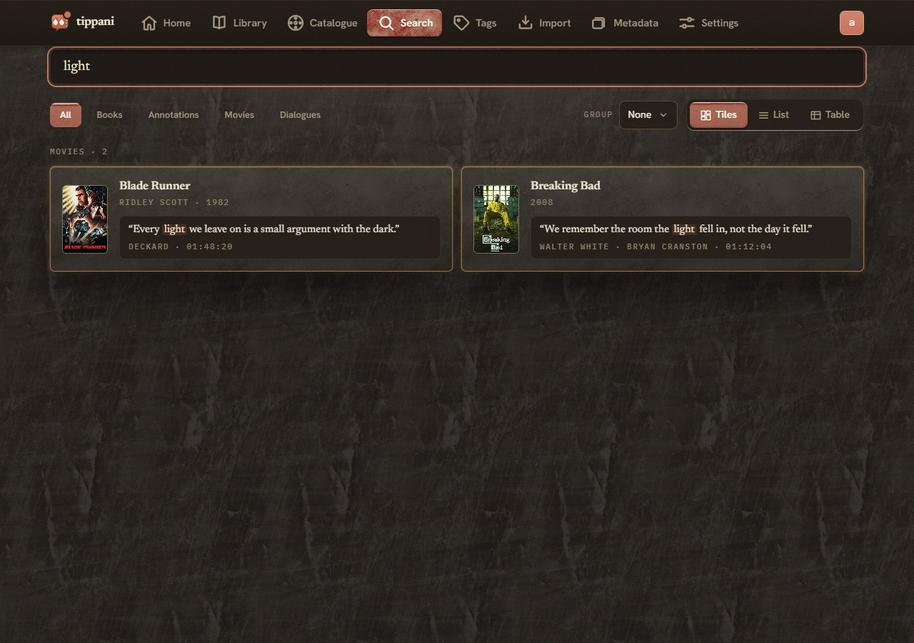
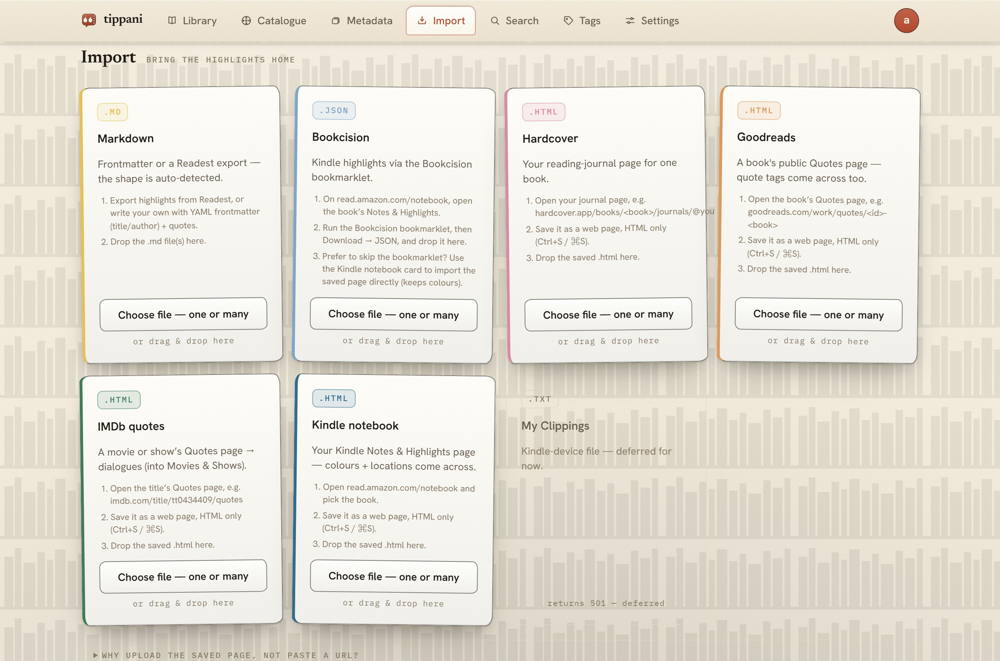
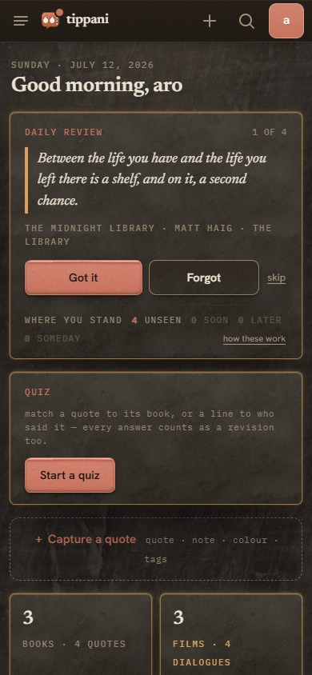

<h1 align="center">Tippani</h1>

<p align="center"><em>ṭippaṇī · टिप्पणी · টিপ্পনী — a marginal annotation</em></p>

<p align="center">
  A self-hosted, multi-user home for your <strong>book highlights</strong> and <strong>movie dialogues</strong> —<br>
  paste or bulk-import quotes, tag · colour · favourite · rate them, auto-fetch covers &amp; metadata,<br>
  search everything instantly, and export it all back out as Obsidian-friendly Markdown.
</p>

<p align="center">
  <a href="https://github.com/aaronified/tippani/actions/workflows/ci.yml"></a>
  <a href="https://github.com/aaronified/tippani/releases"></a>
  <a href="go.mod"></a>
  <a href="https://github.com/aaronified/tippani/pkgs/container/tippani"></a>
  
  <a href="LICENSE"></a>
</p>

<p align="center">
  🎭 <a href="https://aaronified.github.io/tippani/">Interactive demo</a> — a read-only click-around with dummy data
  that tracks the current frontend (it rebuilds whenever the UI changes). Writes are disabled; everything else is
  the real interface.
</p>

---

Built for low-powered NAS boxes that already run a hundred other things: a single static Go
binary (~12 MB, `linux/amd64`), SQLite + FTS5, **~10 MB idle RSS** (measured; set `GOMEMLIMIT`
to cap it — the systemd unit uses 64 MiB), and **zero background jobs** (no pollers, timers, or
cron). It serves plain HTTP on port 8080 for your LAN — bring your own TLS via a reverse proxy /
Tailscale / Netbird / Twingate when you want remote or encrypted access. No Node at runtime;
metadata lookups are on-demand and optional (nothing external is required to run); covers and
posters are served from your own disk.

The full design lives in [`docs/PLAN.md`](docs/PLAN.md); release history is in
[`CHANGELOG.md`](CHANGELOG.md).

## Screenshots

> ⚠️ Under active development — these screenshots may lag behind the current UI.

<table>
  <tr>
    <td width="38%"></td>
    <td width="38%"></td>
    <td width="24%"></td>
  </tr>
  <tr>
    <td width="38%"></td>
    <td width="38%"></td>
    <td width="24%"></td>
  </tr>
</table>

<p align="center"><sub>Desktop — Books (paper · light) · Catalogue (film · dark) · Search (film · dark) · Import (paper · light). Mobile — Books &amp; the Home daily review (film · dark).</sub></p>

## Features

- 📚 **Books & annotations** — quotes and notes with 4 highlight colours, tags, chapter/location,
  a favourite ★ and series/reading-order metadata. Browse as a packed masonry, a
  list, or a sortable table; filter by any combination, and **group by series, author, decade, or
  genre**.
- 🧠 **Daily review & quiz** — spaced repetition grounded in the memory research. Every highlight
  carries a **memory half-life** and resurfaces along the **Ebbinghaus forgetting curve**: recall
  probability decays as $p = 2^{-t/h}$ — where $t$ is the days since you last saw it and $h$ is its
  half-life — so a card comes due right as you're about to forget it. Your verdict moves the half-life
  the **SM-2 / expanding-retrieval** way:
  - ***Got it*** — stretch the interval (the half-life grows);
  - ***Forgot*** — a lapse: shortened, never hard-reset;
  - ***Skip*** — benched for the rest of the local day.

  That is the **active-recall** effect the retention research keeps confirming. A **recall quiz** turns
  your own library into quick multiple-choice rounds — match a quote to its book, or a line to who said
  it; **get one right and it counts as a revision too** (a wrong guess never moves your schedule). Two
  to three minutes a day, sane defaults (deck size, quiz length/scope and the half-life factors are
  tunable in Settings), no gamification — a dot on the logo marks a waiting deck,
  and a *"where you stand"* readout shows how many quotes are unseen · soon · later · someday.
- 🎬 **Movies & dialogues** — capture memorable lines with timestamp, character, and actor; the
  actor auto-fills from the film's cast. Same tags / favourite / views / filters as books.
- 📱 **Phone-first ergonomics** — an installable PWA with a hamburger-drawer nav, a Home screen
  (daily review · quick capture · stats · recent favourites) a logo-tap away, sticky page bars,
  full-screen filter and capture sheets with a Reset · count · Done footer, 44 px touch targets,
  and no horizontal scroll. The same binary serves desktop and phone; nothing to install.
- 🎨 **Stickers** — upload your own transparent PNG/SVG images, manage them on the Tags page, and
  pin one to any quote as a seal the text flows around — drag it wherever you like within the block.
- 📥 **Bulk import** — Markdown (Tippani frontmatter **and** Readest exports, auto-detected), Kindle
  **Bookcision** JSON, saved **Hardcover** and **Goodreads** pages, your **Kindle notebook**
  (read.amazon.com), and **IMDb** quote pages for film dialogue. Re-imports are idempotent, and the
  same passage synced from differently-formatted tools collapses to one row.
- 📤 **Export** — any book or movie to Obsidian-friendly Markdown, a filtered set as one multi-item
  file, or the whole library as a zip. Book exports round-trip cleanly back through the importer.
- 💬 **Share a quote** — one click on any highlight or dialogue opens a share sheet that formats it
  for **Rich Markdown**, **WhatsApp**, **plain text** (Twitter/X, SMS), or **Reddit**. Choose which
  fields to include, tweak the text, and copy it — with a live, per-format preview.
- 🔎 **Instant search** — injection-safe SQLite FTS5 across titles, authors, directors, genres,
  **series**, quotes, notes, and dialogue (find a line by its text, its character, or its actor).
  View as tiles, a list, or sortable tables; **group by** the same axes as the Library; **open any
  quote in place** to share/edit/delete; **select results** for a bulk tag or field edit — and your
  last search is remembered when you come back.
- 🖼 **Metadata & covers** — books from Google Books + Open Library, films and shows from
  [TMDB](https://www.themoviedb.org/) + TheTVDB. Covers, posters and portraits are fetched at full
  resolution through an SSRF-guarded fetcher and served locally, never hotlinked. A **Metadata
  console** shows per-field coverage, filters by what's missing, bulk-corrects a selection, and merges
  duplicates; "fetch missing covers & metadata" runs in chunks behind a **real progress bar**.
- 👤 **People** — click any author or actor name for a menu of their **IMDb · TMDB · TheTVDB ·
  Wikipedia · Open Library** pages, resolved automatically on first open. **Portraits are fetched
  automatically too**, and matched to the right person — an actor from the film's own cast, an author
  from Open Library cross-checked against the books they wrote, so a same-name namesake isn't picked
  by mistake. They power the group-by headings; a per-person bio lives one tap deeper, and you can
  always paste your own photo. A People console under Metadata manages everyone in your library.
- 🔐 **Multi-user** — per-user isolated libraries and a **Profile** area (photo · display name ·
  password) behind the avatar chip; first-run admin onboarding and in-app user management with
  **admin role grant / revoke / transfer** (the last admin is protected); bcrypt + hashed-token
  sessions, stdlib CSRF, login rate limiting.
- 🔗 **Real URLs** — every tab and book/film detail has its own address, so browser (and mouse)
  back/forward work and a link deep-links straight to the view.
- 🪶 **Frugal** — one static binary, WAL SQLite, no pollers or cron; designed to sit quietly on a
  shared NAS.

> **Roadmap** — **dialogues in the daily-review deck** (the quiz already covers them); more ways in
> (Kindle `My Clippings.txt`, Kobo, Apple Books, Readwise & read-later imports; a PWA
> **share-target** and a page-HTML **bookmarklet**); force-fetch & re-verify metadata (review
> before apply); opt-in AI summaries (OpenAI-compatible) with push notifications (NTFY, likely via
> [Shoutrrr](https://containrrr.dev/shoutrrr/)); a [Homepage](https://gethomepage.dev) dashboard
> widget; more interface declutter (one **＋ Add**, progressive-disclosure cards & edit forms);
> **quote-card images**, one-click **backup/restore**, and collections & shelves; the Profile area
> growing into passkeys/2FA, trash-and-undo and per-user API tokens; and quiet, opt-in
> **achievements** — reading milestones plus one gentle spaced-repetition streak.
> See [`ROADMAP.md`](ROADMAP.md).

## Quick start (Docker Compose)

Pull the prebuilt image from GHCR (multi-arch — see the platform note below). Save this as
`docker-compose.yml`:

```yaml
services:
  tippani:
    image: ghcr.io/aaronified/tippani:latest
    container_name: tippani
    restart: unless-stopped
    ports:
      # Reachable on your LAN. First-run onboarding is unauthenticated (the first
      # visitor claims admin) — onboard promptly, or prefix with 127.0.0.1: to
      # bind host-local and front it with a reverse proxy/VPN.
      - "8080:8080"
    volumes:
      # /data holds the SQLite DB + downloaded covers. Use the named volume
      # below, OR bind-mount any host folder you already back up, e.g.:
      #   - /srv/tippani:/data
      - tippani-data:/data
    # environment:
    #   TIPPANI_COOKIE_SECURE: "1"   # when a TLS-terminating proxy is in front
    #   TIPPANI_TRUSTED_PROXY: "1"   # to trust X-Forwarded-For for the login limiter
    #   GOMAXPROCS: "1"              # NAS-friendly runtime caps (see PLAN §8)
    #   GOMEMLIMIT: "64MiB"
    #   GOGC: "200"

# Only needed if you use the named volume above; delete this block when you
# bind-mount a host folder instead.
volumes:
  tippani-data:
```

Then:

```sh
docker compose up -d
```

…or grab the file and start in one go:

```sh
curl -O https://raw.githubusercontent.com/aaronified/tippani/main/docker-compose.yml
docker compose up -d
```

Open `http://<nas-ip>:8080` and **create the admin account** on the first-run onboarding screen;
the admin adds any further users from inside the app. When a TLS-terminating proxy sits in front,
set `TIPPANI_COOKIE_SECURE=1`.

> **First-run security:** onboarding is unauthenticated — whoever reaches the port first while the
> user table is empty becomes the admin. On a shared LAN, bring the stack up and create your admin
> right away (or bind host-local with `127.0.0.1:8080:8080` until you have). After that, onboarding
> closes and all routes require a login.

> **Platforms:** published as a multi-arch image — `linux/amd64` is the tested arch; `linux/arm64`
> is built and published too (pure Go, cross-compiles cleanly) but is **untested**. arm64 NAS
> owners (Synology/QNAP/Pi): give it a try and report back.

## Build from source

Requires Go 1.26+ (Node only to rebuild the frontend, and only on your dev machine).

```sh
make build                         # -> bin/tippani (CGO_ENABLED=0, static)
./bin/tippani serve                # http://127.0.0.1:8080, then onboard in the browser
```

Bootstrap a user without the browser (the first user created becomes the admin):

```sh
printf '%s\n' 'a-long-password' | ./bin/tippani user add alice
```

Rebuild the frontend after changing it (re-embeds into the binary):

```sh
make frontend    # builds the SPA into web/dist
make build       # re-embed
```

## Configuration

| Env | Default | Meaning |
| :-- | :-- | :-- |
| `TIPPANI_BIND` | `127.0.0.1:8080` | Listen address (binary default). The Docker image sets `0.0.0.0:8080` so the published port is LAN-reachable; override to bind elsewhere |
| `TIPPANI_DATA` | `./data` | Data dir (SQLite DB + downloaded covers/posters) |
| `TIPPANI_COOKIE_SECURE` | `0` | Set `1` when TLS terminates in front of the app |
| `TIPPANI_TRUSTED_PROXY` | `0` | Set `1` to trust `X-Forwarded-For` for login rate limiting |

**Metadata API keys — TMDB, TheTVDB, Google Books — are configured in the app**, not via environment:
sign in → **Settings → metadata keys**, and paste a TMDB v3 key or v4 read token from
[themoviedb.org](https://www.themoviedb.org/settings/api) (TheTVDB and Google Books keys are optional —
TMDB alone covers most catalogues). There is also an optional built-in TMDB slot (`defaultTMDBKey` in
[`cmd/tippani/main.go`](cmd/tippani/main.go)) for shipping a Jellyfin-style shared app key — **currently
empty**, so until a key is saved (or that constant is filled) movie lookup answers `503` and manual
entry still works. Everything else works with no key.

Runtime tuning for a shared NAS (see [`deploy/tippani.service`](deploy/tippani.service)):
`GOMAXPROCS=1`, `GOMEMLIMIT=64MiB`, `GOGC=200`.

Backup: nightly `sqlite3 data/tippani.db "VACUUM INTO 'backup.db'"` from cron, off-peak.

## Users

The **first user** is the admin, created either by the browser onboarding screen on first run or
by the CLI when the database is still empty. The admin manages everyone else from the in-app
**Users** panel (add / remove); onboarding closes automatically once a user exists.

The CLI remains available for bootstrapping and scripting:

```sh
tippani user add <name>      # password read from stdin (first user -> admin)
tippani user passwd <name>
tippani user del <name>      # cascades to that user's books/annotations
```

Each user has a fully isolated library (PLAN §2). Passwords change in-app via `POST /auth/password`.

## Layout

```text
cmd/tippani/          entrypoint: serve + user subcommands + healthcheck
internal/store/       SQLite open (WAL etc.), embedded migrations, dedupe hash, schema tests
internal/auth/        bcrypt, hashed-token sessions, login rate limiter
internal/httpapi/     routes (Go 1.22 patterns), CSRF, security headers, all handlers + exports
internal/search/      FTS5 MATCH escaping (never pass raw input to MATCH)
internal/importer/    markdown (frontmatter + Readest), Bookcision, Hardcover, Goodreads,
                      Kindle-notebook and IMDb-quotes parsers
internal/metadata/    Google Books / Open Library / TMDB / TheTVDB clients, person-link
                      resolution (incl. Wikipedia via Wikidata), SSRF-guarded cover fetcher
web/frontend/         Vite + React 19 + Tailwind v4 source (+ the read-only demo shim)
web/dist/             built SPA, embedded via go:embed
deploy/               Caddyfile + systemd examples
docs/PLAN.md          the design document this repo implements
docs/ui-glossary.html visual glossary of every UI component
.github/workflows/    CI (go test/vet, frontend build), GHCR image publish, Pages demo deploy
```

## Publishing note

The module path is plain `tippani`. When you push this as `github.com/YOU/tippani`:

```sh
grep -rl '"tippani/' --include='*.go' . | xargs sed -i 's|"tippani/|"github.com/YOU/tippani/|g'
sed -i 's|^module tippani$|module github.com/YOU/tippani|' go.mod
```

## Attribution

Book metadata comes from [Google Books](https://books.google.com/) and
[Open Library](https://openlibrary.org/); book covers and author images from
[Amazon](https://www.amazon.com/). All movie and show metadata and posters come from the
[TMDB](https://www.themoviedb.org/) and [TheTVDB](https://thetvdb.com/) APIs — this product uses
the TMDB and TheTVDB APIs but is not endorsed or certified by either. Author/actor reference
links resolve through Open Library, TMDB, and [Wikidata](https://www.wikidata.org/) (for the
Wikipedia hop), and link out to IMDb, TMDB, TheTVDB, Wikipedia, and Open Library.

Standing on the shoulders of:

- **[pretext](https://github.com/chenglou/pretext)** — the text-reflow calculation that lets a quote wrap naturally around a pinned
  sticker (the `FlowQuote` seal).
- **[CC0 Textures](https://cc0-textures.com/)** — the public-domain (CC0) texture packs behind the
  paper·wood·metal·glass surfaces of the paper/film skins.
- **[Bookcision](https://bookcision.readwise.io/)** and **[Readest](https://github.com/readest/readest)** — we read their highlight / Markdown exports directly as import
  sources; thanks to both apps for making Kindle and cross-device highlights portable.

## License

MIT — see [`LICENSE`](LICENSE).
