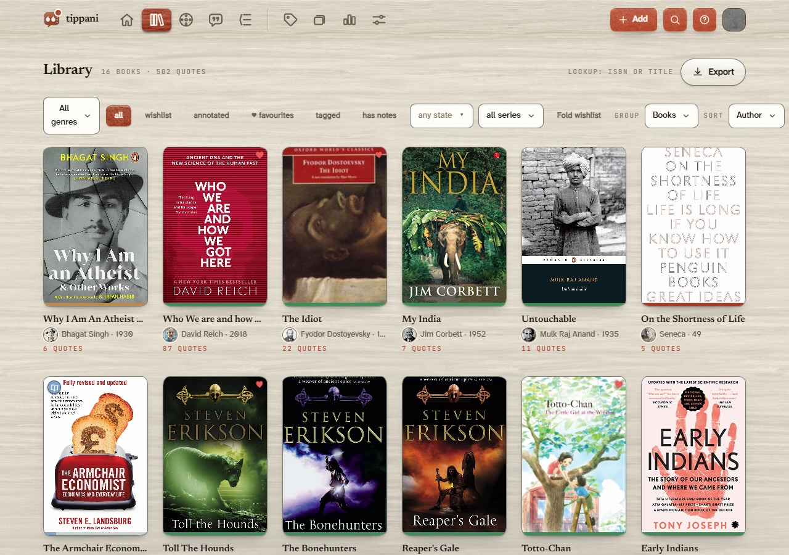
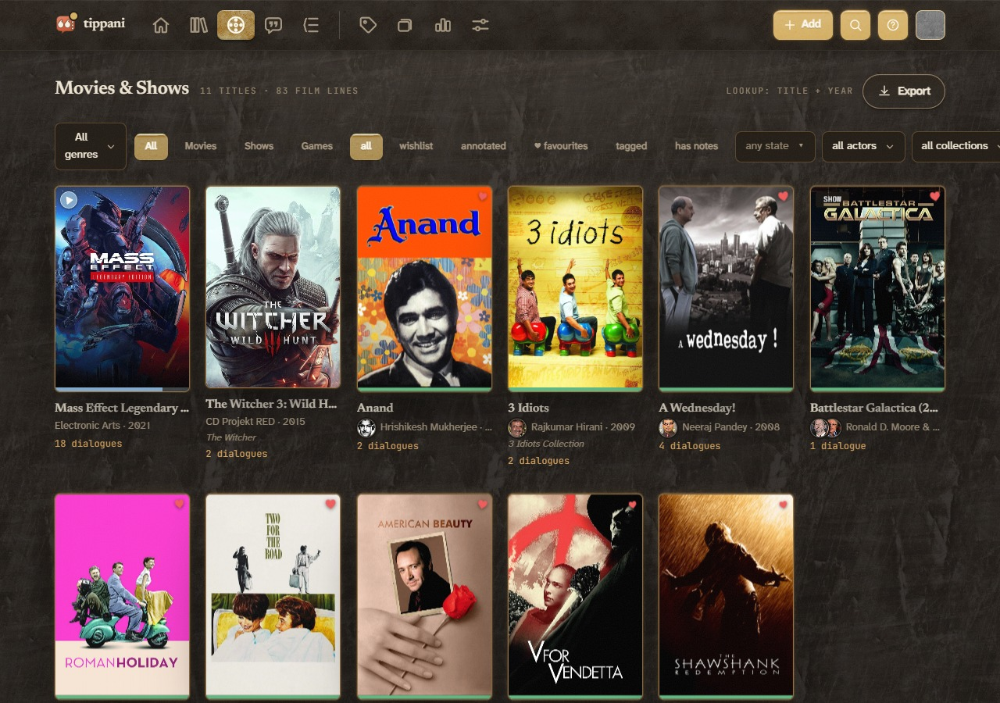
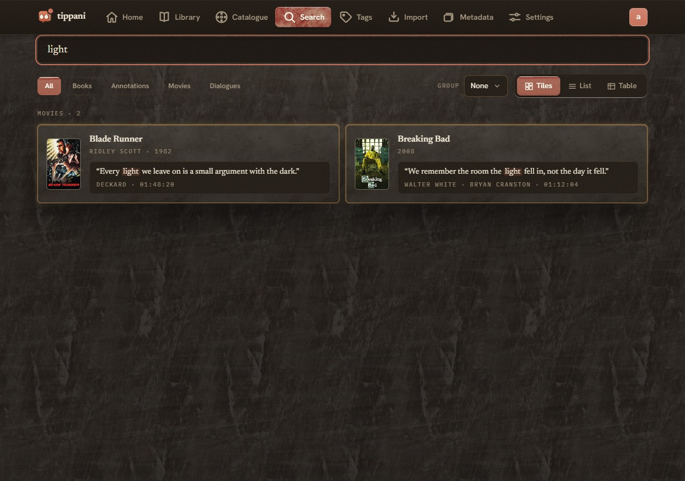
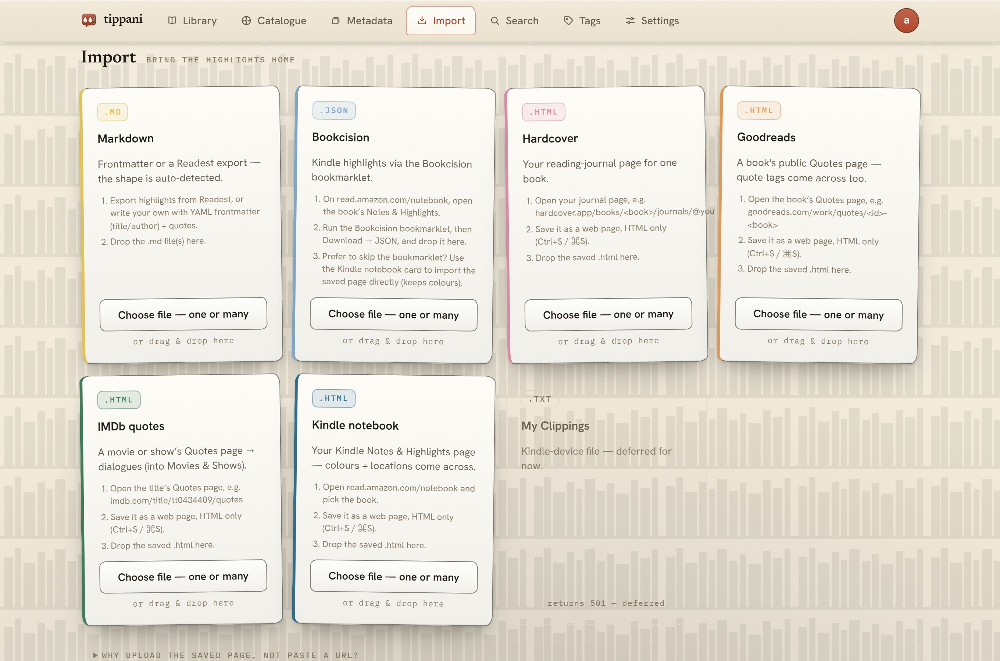
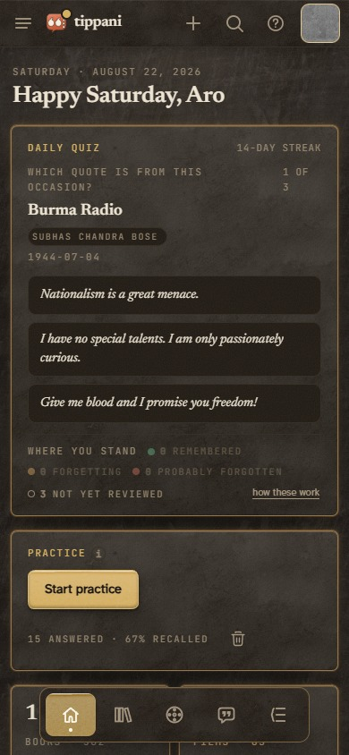

<h1 align="center">Tippani</h1>

<p align="center"><em>ṭippaṇī · टिप्पणी · টিপ্পনী — a marginal annotation</em></p>

<p align="center">
  A self-hosted, multi-user home for your <strong>book highlights</strong>, <strong>movie dialogues</strong> and <strong>quotes from anywhere else</strong> —<br>
  paste or bulk-import quotes, tag · colour · favourite · rate them, auto-fetch covers &amp; metadata,<br>
  search everything instantly, and export it all back out as Obsidian-friendly Markdown.
</p>

<p align="center">
  <a href="https://github.com/aaronified/tippani/actions/workflows/ci.yml"></a>
  <a href="https://github.com/aaronified/tippani/releases"></a>
  <a href="https://aaronified.github.io/tippani/roadmap.html"></a>
  <a href="go.mod"></a>
  <a href="https://github.com/aaronified/tippani/pkgs/container/tippani"></a>
  
  <a href="LICENSE"></a>
</p>

<p align="center">
  🎭 <a href="https://aaronified.github.io/tippani/">Interactive demo</a> — a read-only click-around with dummy data
  that tracks the current frontend (it rebuilds whenever the UI changes). Writes are disabled; everything else is
  the real interface.
</p>

<p align="center">
  🗺 <strong><a href="https://aaronified.github.io/tippani/roadmap.html">The roadmap</a></strong> — everything planned,
  every bug I already know about, and the things I have<br>
  <a href="https://aaronified.github.io/tippani/roadmap.html#aside">set aside on purpose</a>. Worth reading before you
  ask for something, and it takes requests:<br>
  <a href="https://github.com/aaronified/tippani/issues/new?template=feature_request.yml"><strong>request a feature</strong></a>
  ·
  <a href="https://github.com/aaronified/tippani/issues/new?template=bug_report.yml"><strong>report a bug</strong></a>
  — once I accept one, it lists itself on the roadmap and delists itself when it is fixed.
</p>

---

Built for low-powered NAS boxes that already run a hundred other things: a single static Go
binary (~12 MB, `linux/amd64`), SQLite + FTS5, **~25 MB idle RSS** (the budget I hold it
within; set `GOMEMLIMIT` to cap it — the systemd unit uses 64 MiB), and **zero background jobs** (no pollers, timers, or
cron). It serves plain HTTP on port 8080 for your LAN — bring your own TLS via a reverse proxy /
Tailscale / Netbird / Twingate, or hand it a PEM pair (`TIPPANI_TLS_CERT`/`_KEY`, hot-reloaded)
and it serves HTTPS itself. No Node at runtime;
metadata lookups are on-demand and optional (nothing external is required to run); covers and
posters are served from your own disk.

What is coming next is on **[the roadmap](https://aaronified.github.io/tippani/roadmap.html)** —
twenty-five numbered sections, the bugs I already know about, and a
[list of things refused on purpose](https://aaronified.github.io/tippani/roadmap.html#aside)
so the boundaries stay decisions rather than gaps. The full original design lives in
[`docs/PLAN.md`](docs/PLAN.md); release history is in
[`CHANGELOG.md`](CHANGELOG.md). **Building it, changing it, or forking it into your own
thing** is [`DEVELOPMENT.md`](DEVELOPMENT.md) — it covers the handful of strings that
still say my name, and the pull-request conventions. Tippani was **written with AI
assistance** and the
app itself **contains no AI** — no model calls, nothing sent anywhere. Both halves
of that are spelled out in [`AI.md`](AI.md).

## Screenshots

> ⚠️ Under active development — these screenshots may lag behind the current UI.

<table>
  <tr>
    <td width="38%"></td>
    <td width="38%"></td>
    <td width="24%"></td>
  </tr>
  <tr>
    <td width="38%"></td>
    <td width="38%"></td>
    <td width="24%"></td>
  </tr>
</table>

<p align="center"><sub>Desktop — Books (paper · light) · Catalogue (film · dark) · Search (film · dark) · Import (paper · light). Mobile — Books &amp; the Home Daily Quiz (film · dark).</sub></p>

## Features

- 📚 **Books & annotations** — quotes and notes with 4 highlight colours, tags, chapter/location,
  a favourite ★ and series/reading-order metadata. Browse as a packed masonry, a
  list, or a sortable table; filter by any combination, and **group by series, author, decade, or
  genre**.
- 🧠 **Daily Quiz & Practice** — spaced repetition grounded in the memory research, over your
  **books, films/shows *and* standalone quotes** alike. Every highlight carries a **memory half-life** and resurfaces
  along the **Ebbinghaus forgetting curve**: recall probability decays as $p = 2^{-t/h}$ — where $t$
  is the days since you last saw it and $h$ is its half-life — so a card comes due right as you're
  about to forget it. Each card is a **multiple-choice** question in one of two directions — *which
  work is this quote from?* (pick the title) or *which quote is from this work?* (pick the quote) — with
  **plausible distractors**: for books, other works by the **same author** first, then the closest by
  **shared genre**; for films/shows, the closest by **shared genre**, then a **shared actor**. A correct
  pick counts as ***Got it*** (the half-life climbs); a wrong one as ***Forgot*** (a lapse — the card
  starts over); Practice also allows ***Skip*** (no effect on the schedule).

  The **Daily Quiz** is the scheduled session: every card due that day, no skipping, each grade folded
  into your schedule, with a permanent score and streak. **Practice** is unlimited, skippable, on-demand
  study for exams or a refresher — and by default it *doesn't* touch your schedule (a Settings toggle
  opts in), with its own resettable score. Every quote in the Library and Catalogue wears a **status
  dot** — 🟢 **remembered**, 🟡 **forgetting**, 🔴 **probably forgotten** (renamed from the old
  soon/later/someday for clarity) — and hovering it shows the half-life. The half-life climbs a fixed
  ladder — **7 → 30 → 100 days**, one rung per successful recall, holding at 100 — and a single
  lapse drops it straight back to 7 from any rung. A quote you've **just saved counts as remembered
  for its first week** before it joins the rotation — you did, after all, just write it down. Two to
  three minutes a day, sane defaults (deck size and scope are tunable in Settings), no gamification —
  a dot on the logo marks a waiting deck.
- 🎬 **Movies & dialogues** — capture memorable lines with timestamp, character, and actor; the
  actor auto-fills from the film's cast. Same colours / tags / favourite / views / filters as
  books: a film line and a book highlight are the same kind of thing, and differ only in how they
  point back at their source. **A show's lines also carry the episode** — a timestamp is the whole
  answer for a film and no answer at all for a series — so they read as *S2E6* and sort through the
  run rather than by the clock alone. Season 0 is a real season, so your specials keep their place.
- 💬 **Quotes from anywhere else** — a line from a speech, a letter, an interview, a song, a
  proverb, something a friend said. The third kind of quote, and the first with no work behind it:
  instead of a chapter and a page it carries the **occasion** — who said it, on what occasion, when,
  where, and through what medium. The occasion is also the locator, and unlike a page number it
  **tells two quotes apart**: the same words said on two occasions are two quotes, not one. A quote
  with no attribution at all is perfectly fine to keep and simply stays out of the review deck —
  there is nothing to recall but the words already in front of you. Same colours, tags, favourite,
  stickers, sharing and export as the other two — the same *screen*, in fact: one scaffold draws the
  Library, the Catalogue and this, so the filter row, the counts and the empty states are not three
  implementations that resemble each other. The **speaker** takes a portrait and a bio like any
  author or actor, is clickable on the card the way an author is on a book, and counts as a credit,
  so a line two people said together is filed under both. And because a quote here has no parent to
  group by, it groups by the four things it has instead: **who said it, through what medium, where,
  and when**.
- 🔖 **Shelves — what you're reading, what you gave up on, what you've never opened.** Every work
  carries a **status** — *reading* / *watching* · *paused* · *abandoned* · *completed* — drawn as a
  Radarr-style **colour bar under the cover** (the artwork itself stays unobscured): blue in flight
  and filled to your progress, amber held, red given up, green done. Whatever you're on with right
  now pins to the **top of the default sort** and wears an open-book (or ▶) mark. Anything you
  haven't quoted from yet is automatically on the **Wishlist** — no bookkeeping, it clears itself the
  moment you add a quote — and the filter row's `all · wishlist · annotated` chips let you browse
  just those, or hide them and see only what you've actually marked up.

  Progress is yours to keep, in the units the thing is made of: a **percentage**, or the **page
  you're on out of the book's pages** (for physical books, no arithmetic in your head), or a show's
  **season and episode**. Finishing a work logs a **read**, so a reread is history rather than an
  overwrite: a `×3` chip opens the dates you read it, each as precise as you actually know —
  `2019`, `2021-02`, or a full day, via a calendar that lets you stop at a year. A soft cap
  (5 books · 2 films · 5 shows) offers to settle something when the shelf gets crowded, and always
  lets you carry on anyway. All of it round-trips through the Markdown export.
- 📱 **Phone-first ergonomics** — an installable PWA with a hamburger-drawer nav, a Home screen
  (daily quiz · practice · stats · recent favourites) a logo-tap away, quote capture one ❝ tap away
  in every top bar and the drawer, sticky page bars, full-screen filter sheets with a
  Reset · count · Done footer, 44 px touch targets, and no horizontal scroll. The same binary
  serves desktop and phone; nothing to install.
- 🎨 **Two skins, and they are made of something.** Paper is a note lifted off a desk — torn-edged
  cards on paper fibre, leather buttons that tilt half a degree, a wooden shell. Film is a frame on a
  light table — square corners, an amber hairline, brushed metal, rubber keys. Every card, button,
  thumb, bar and backdrop carries a real grayscale texture tile blended into it, so the toggle
  changes what the app is *made of* rather than its corner radius. **Light, dark, or whatever your
  system says**, four accents, your own cover sizes, and — since 1.6.0 — whether a button that has a
  glyph also shows its words.
  <br><br>
  **And a way out of all of it.** If your system asks for more contrast or less transparency, every
  texture drops to zero: the page grain, the backdrop, the card and shell tiles, the dither. Borders,
  colours and layout do not move, so what is left is the same app with the noise taken off. The
  textures are the whole point of the design and they are not free — the page grain is a fixed layer
  above *everything*, including every glyph and every input on the screen.
- 🏷️ **Stickers** — upload your own transparent PNG/SVG images, manage them on the Tags page, and
  pin one to any quote as a seal the text flows around — drag it wherever you like within the block.
- 📥 **Bulk import** — Markdown (Tippani frontmatter for all three kinds **and** Readest exports,
  auto-detected), Kindle
  **Bookcision** JSON, saved **Hardcover** and **Goodreads** pages, your **Kindle notebook**
  (read.amazon.com), the Kindle device's own **`My Clippings.txt`** (every book in one file —
  *experimental*: Amazon never documented that format and localises it, so a device in another
  language can produce records the parser misreads; nothing is guessed at, and whatever can't be
  read is skipped and counted back to you), and **IMDb** quote pages for film dialogue. Re-imports
  are idempotent, and the same passage synced from differently-formatted tools collapses to one row.
- 🧺 **Nothing lands until you okay it** — an import parses into a **pending queue** rather than into
  your library, and waits there as long as you like. One list for everything staged from every file,
  grouped by the book or film each quote will attach to, with every group saying where it is headed
  before anything is written. Fix a whole file at once: tags on *and* off, colour, favourite,
  chapter, character, actor — **move quotes onto the right work, book and film interchangeable** —
  and shift locations by formula (add · subtract · multiply · divide · set · reset), which is what a
  Kindle location-to-page division or a PDF page offset actually needs; `p.142` minus 5 is `p.137`,
  and *reset* restores every row's as-imported value. Then approve, discard, or leave it for later.
  Staged quotes are invisible to search and to the review deck until approved.
- 📤 **Export** — any book or movie to Obsidian-friendly Markdown, a filtered set as one multi-item
  file, your standalone quotes as their own file, or the whole library as a zip. Exports round-trip
  cleanly back through the importer — re-importing and approving one is a no-op, not a pile of
  duplicates. A quotes file groups by the occasion the way a book export groups by chapter, and the
  unattributed ones come first.
- 📨 **Share a quote** — one click on any highlight, dialogue or standalone quote opens a share sheet that formats it
  for **Rich Markdown**, **WhatsApp**, **plain text** (Twitter/X, SMS), or **Reddit** — or renders it
  as a **shareable image** in your current paper/film skin, generated locally. Choose which fields to
  include, tweak the text, and copy or download it — with a live preview.
- 🔎 **Instant search** — injection-safe SQLite FTS5 across titles, authors, directors, genres,
  **series**, quotes, notes, tags, and dialogue (find a line by its text, its character, or its
  actor). Results come back **sectioned by what matched** — books · movies · authors · directors ·
  actors · speakers · annotations · dialogues · quotes · notes · tags · genres — plus a **decade** query ("1990s") and
  a **date-added** query ("2026-07-14", where the Stats calendar dots link). View as tiles, a
  list, or sortable tables; **group by** the same axes as the Library; **open any quote in place**
  to share/edit/delete; **select results** for a bulk tag or field edit — and your last search is
  remembered when you come back.
- 🖼 **Metadata & covers** — books from Google Books + Open Library, films and shows from
  [TMDB](https://www.themoviedb.org/) + TheTVDB. Covers, posters and portraits are fetched at full
  resolution through an SSRF-guarded fetcher and served locally, never hotlinked. A **Metadata
  console** shows per-field coverage, filters by what's missing, bulk-corrects a selection, and merges
  duplicates; "fetch missing covers & metadata" runs in chunks behind a **real progress bar**.
- 👤 **People** — click any author or actor name for a menu of their **IMDb · TMDB · TheTVDB ·
  Wikipedia · Open Library** pages, resolved automatically on first open. **Portraits are fetched
  automatically too**, and matched to the right person — an actor from the film's own cast, an author
  from Open Library cross-checked against the books they wrote, so a same-name namesake isn't picked
  by mistake. They power the group-by headings; a per-person bio lives one tap deeper, and you can
  always paste your own photo. A People console under Metadata manages everyone in your library.
- 🔐 **Multi-user** — per-user isolated libraries and a **Profile** screen the avatar chip opens
  directly: photo, display name, password, **switching to another account** (its own password every
  time — being an admin does not let you in without one), logging out, and, for an admin, the user
  list itself — add, remove, **grant / revoke / transfer admin** (the last admin is protected).
  First-run admin onboarding; bcrypt + hashed-token sessions, stdlib CSRF, login rate limiting.
  Passwords are 8–20 characters of printable ASCII, which is narrower than it looks arbitrary: a
  password doubles as the key to your backup archives, so it has to survive being re-typed on
  another machine's keyboard months later.
- 📲 **Paired devices** — **Settings → Devices** mints a one-shot pairing code that a native
  client exchanges for a long-lived bearer token, so a phone never holds your password. A device
  stays paired until you unpair it: changing your password signs out browsers but deliberately
  leaves phones alone, because silently unpairing every device on a routine password change is
  worse than the threat it would prevent. Unpair one, or all, from the same panel. (The Android
  app itself is in progress — see [the roadmap](https://aaronified.github.io/tippani/roadmap.html) §23.)
- 🔗 **Real URLs** — every tab and book/film detail has its own address, so browser (and mouse)
  back/forward work and a link deep-links straight to the view.
- 🔄 **In-app updates** — Settings shows your running version and checks GitHub for a newer release
  **on demand** (never automatically). If you mount the Docker socket or point it at a
  **docker-socket-proxy** (**opt-in**, a deliberate security trade-off — see the Configuration
  section), one click pulls the new image and restarts the
  container; otherwise it hands you the exact `docker compose pull && up -d` to run.
- 💾 **Backup & restore, encrypted** — one click in Settings builds a dated archive of the whole
  data directory (a consistent snapshot of the live database plus every stored image) and downloads
  it; the newest is kept on the server, and restoring swaps the whole data directory back
  **in-process**, no Docker socket needed. One control, two sources: the archive kept here, or a
  file taken off **another Tippani server** — so moving to a new box is spinning up a fresh instance
  and handing it your archive (available on the first-run screen too, no SSH required).
  <br><br>
  The archive holds every user, every library, password hashes and your API keys, so it is
  **AES-256-GCM sealed** before it leaves the server. Each archive gets its own random key, and
  that key is written into the header **twice**:
  <br><br>
  — under **your password** (Argon2id), which travels with the file. This is what opens it on
  another machine, on a fresh install, with nothing but the file and what you know.
  <br>
  — under this **instance's recovery key**: 32 random bytes in the data directory, deliberately
  never inside the archive and never moved by a restore. This is why **changing your password no
  longer orphans your backups** — on the server that made an archive, your *current* password
  opens it, whichever password sealed it.
  <br><br>
  Prefer a key tied to no login at all? Set a **passphrase** when you back up. That archive gets no
  recovery wrap, on purpose, which also makes it the only kind you can lose outright.
  <br><br>
  Restoring reads the header first and asks for exactly the credential it names, so a
  passphrase-sealed archive is never met with a password field, and it says whether *this* box can
  recover the archive rather than making you find out by typing. It is authenticated as well as
  encrypted: re-ordered, spliced, header-edited and **truncated** archives are all refused rather
  than half-applied — because a backup silently missing its tail looks like a backup — and a
  damaged body is reported as damage, never as a wrong password.
  <br><br>
  What this is **not**: a fixed key baked into the binary. This repository is MIT-licensed, so that
  constant would be public, and "encrypted with a published key" reads as protection while
  providing none. It is also not a signature — anyone holding the credentials can produce a valid
  archive. And it does not defend the box: whoever can read the data directory holds both the
  recovery key and the database it protects. Archives from before 1.4.1 are plain `.tar.gz` and
  still restore; 1.4.1's own one-hour format does not, and says so by name.
- 🪶 **Frugal** — one static binary, WAL SQLite, no pollers or cron; designed to sit quietly on a
  shared NAS.

> **Roadmap** — an **Android app** that photographs a page of a physical book and turns it into a
> highlight, with OCR **on the device** (the server gains no dependency); more ways in
> (Kobo, Apple Books, Readwise & read-later imports; a PWA **share-target** and a page-HTML
> **bookmarklet**); opt-in AI summaries (OpenAI-compatible) with
> push notifications (NTFY, likely via [Shoutrrr](https://containrrr.dev/shoutrrr/)); a
> [Homepage](https://gethomepage.dev) dashboard widget; collections & shelves; the Profile area
> growing into passkeys/2FA, trash-and-undo and per-user API tokens; and quiet, opt-in
> **achievements** — reading milestones plus one gentle spaced-repetition streak.
> See [the roadmap](https://aaronified.github.io/tippani/roadmap.html).

## Quick start (Docker Compose)

Pull the prebuilt image from GHCR (multi-arch — see the platform note below). Save this as
`docker-compose.yml`:

```yaml
services:
  tippani:
    image: ghcr.io/aaronified/tippani:latest
    container_name: tippani
    restart: unless-stopped
    ports:
      # Reachable on your LAN. First-run onboarding is unauthenticated (the first
      # visitor claims admin) — onboard promptly, or prefix with 127.0.0.1: to
      # bind host-local and front it with a reverse proxy/VPN.
      - "8080:8080"
    volumes:
      # /data holds the SQLite DB + downloaded covers. Use the named volume
      # below, OR bind-mount any host folder you already back up, e.g.:
      #   - /srv/tippani:/data
      - tippani-data:/data
    # environment:
    #   TIPPANI_COOKIE_SECURE: "1"   # when a TLS-terminating proxy is in front
    #   TIPPANI_TRUSTED_PROXY: "1"   # to trust X-Forwarded-For for the login limiter
    #   GOMAXPROCS: "1"              # NAS-friendly runtime caps (see PLAN §8)
    #   GOMEMLIMIT: "64MiB"
    #   GOGC: "200"

# Only needed if you use the named volume above; delete this block when you
# bind-mount a host folder instead.
volumes:
  tippani-data:
```

Then:

```sh
docker compose up -d
```

…or grab the file and start in one go:

```sh
curl -O https://raw.githubusercontent.com/aaronified/tippani/main/docker-compose.yml
docker compose up -d
```

Open `http://<nas-ip>:8080` and **create the admin account** on the first-run onboarding screen;
the admin adds any further users from inside the app. When a TLS-terminating proxy sits in front,
set `TIPPANI_COOKIE_SECURE=1`.

> **First-run security:** onboarding is unauthenticated — whoever reaches the port first while the
> user table is empty becomes the admin. On a shared LAN, bring the stack up and create your admin
> right away (or bind host-local with `127.0.0.1:8080:8080` until you have). After that, onboarding
> closes and all routes require a login.

> **Platforms:** published as a multi-arch image — `linux/amd64` is the tested arch; `linux/arm64`
> is built and published too (pure Go, cross-compiles cleanly) but is **untested**. arm64 NAS
> owners (Synology/QNAP/Pi): give it a try and report back.

## Build from source

Requires Go 1.26+ (Node only to rebuild the frontend, and only on your dev machine).

```sh
make build                         # -> bin/tippani (CGO_ENABLED=0, static)
./bin/tippani serve                # http://127.0.0.1:8080, then onboard in the browser
```

Bootstrap a user without the browser (the first user created becomes the admin):

```sh
printf '%s\n' 'a-long-password' | ./bin/tippani user add alice
```

Rebuild the frontend after changing it (re-embeds into the binary):

```sh
make frontend    # builds the SPA into web/dist
make build       # re-embed
```

## Configuration

| Env | Default | Meaning |
| :-- | :-- | :-- |
| `TIPPANI_BIND` | `127.0.0.1:8080` | Listen address (binary default). The Docker image sets `0.0.0.0:8080` so the published port is LAN-reachable; override to bind elsewhere |
| `TIPPANI_DATA` | `./data` | Data dir (SQLite DB + downloaded covers/posters) |
| `TIPPANI_TLS_CERT` | *(unset)* | Path to a PEM certificate (full chain). With `TIPPANI_TLS_KEY`, Tippani serves **HTTPS directly** — see below |
| `TIPPANI_TLS_KEY` | *(unset)* | Path to the PEM private key. Both or neither; the pair **hot-reloads** when the files change |
| `TIPPANI_COOKIE_SECURE` | `0` | Set `1` when TLS terminates in front of the app (implied automatically when the TLS pair above is set) |
| `TIPPANI_TRUSTED_PROXY` | `0` | Set `1` to trust `X-Forwarded-For` for login rate limiting |
| `TIPPANI_DOCKER_HOST` | *(unset)* | Engine API endpoint for one-click updates: `tcp://host:port` for a **docker-socket-proxy**, or `unix:///path`. Wins over the socket path below |
| `TIPPANI_DOCKER_SOCK` | `/var/run/docker.sock` | Engine API unix-socket path for one-click updates (only relevant with the socket mounted) |
| `TIPPANI_LOG_LEVEL` | `info` | Set `debug` for verbose per-operation `[trace]` logging when diagnosing an issue; errors carry lookup codes documented in [`docs/troubleshoot.md`](docs/troubleshoot.md) |

**Metadata API keys — TMDB, TheTVDB, Google Books — are configured in the app**, not via environment:
sign in → **Settings → metadata keys**, and paste a TMDB v3 key or v4 read token from
[themoviedb.org](https://www.themoviedb.org/settings/api) (TheTVDB and Google Books keys are optional —
TMDB alone covers most catalogues). There is also an optional built-in TMDB slot (`defaultTMDBKey` in
[`cmd/tippani/main.go`](cmd/tippani/main.go)) for shipping a Jellyfin-style shared app key — **currently
empty**, so until a key is saved (or that constant is filled) movie lookup answers `503` and manual
entry still works. Everything else works with no key.

> [!CAUTION]
> **Amazon cookie (optional, use at your own risk).** Under **Settings → Amazon (advanced)** an admin
> may paste an Amazon session cookie to enrich book metadata (description + genres) by scraping the
> product page. This is **off by default and entirely optional** — book covers (keyless image CDN) and
> Kindle highlight import (a file *you* export) both work with no cookie. The cookie is stored
> write-only and never shown back, but be aware it **grants access to your Amazon account** and that
> automated scraping is **against Amazon's Conditions of Use**: the account whose cookie you supply
> bears that risk, so only you can decide to enable it. Tippani never ships, shares, or centralises the
> cookie, and only ever uses it on your own behalf.

Runtime tuning for a shared NAS (see [`deploy/tippani.service`](deploy/tippani.service)):
`GOMAXPROCS=1`, `GOMEMLIMIT=64MiB`, `GOGC=200`.

Backup: nightly `sqlite3 data/tippani.db "VACUUM INTO 'backup.db'"` from cron, off-peak — that
gives you a plain database file you can inspect. The in-app archive is the whole data directory and
is encrypted (see *Backup & restore* above); the two are complementary, not alternatives.

### Serving HTTPS directly (optional)

By default Tippani speaks plain HTTP and you terminate TLS one layer up (reverse proxy, Tailscale,
VPN). If you'd rather skip the proxy container, hand Tippani a certificate and it serves HTTPS
itself:

```yaml
    volumes:
      - tippani-data:/data
      - /srv/certs/tippani:/certs:ro     # cert.pem + key.pem, however you renew them
    environment:
      TIPPANI_TLS_CERT: /certs/cert.pem  # full chain, PEM
      TIPPANI_TLS_KEY: /certs/key.pem
```

- **Bring your own certificate.** A cert from your home CA (trusted on your devices — this is what
  makes the browser padlock, PWA install and clipboard APIs light up), a
  [`tailscale cert`](https://tailscale.com/kb/1153/enabling-https), or a wildcard your existing
  ACME tooling renews. Tippani deliberately does **not** speak ACME itself — a renewal loop is a
  background job with a third-party dependency, and Tippani ships with zero of those.
- **Renewals need no restart.** The pair re-loads on the next TLS handshake after the files change;
  a botched write keeps serving the previous pair and logs `TIP-HTTP-001` instead of dropping HTTPS.
- **Secure cookies are implied** — no need to also set `TIPPANI_COOKIE_SECURE`.
- The container healthcheck adapts automatically. A self-signed cert works too, with the usual
  browser warnings — trusted certs are what remove them.

### One-click updates through a socket proxy (optional)

The in-app update can talk to a [docker-socket-proxy](https://github.com/Tecnativa/docker-socket-proxy)
instead of the raw socket, so no socket file is ever mounted into Tippani:

```yaml
services:
  dockerproxy:
    image: tecnativa/docker-socket-proxy
    restart: unless-stopped
    environment:
      CONTAINERS: 1   # inspect self, create/start the one-shot updater
      IMAGES: 1       # pull the new image
      POST: 1         # the create/start/pull calls above are POSTs
    volumes:
      - /var/run/docker.sock:/var/run/docker.sock:ro
    networks: [tippani-internal]

  tippani:
    image: ghcr.io/aaronified/tippani:latest
    environment:
      TIPPANI_DOCKER_HOST: tcp://dockerproxy:2375
    networks: [default, tippani-internal]
    # …ports/volumes as usual; no docker.sock mount, no group_add needed

networks:
  tippani-internal:
    internal: true    # the proxy is reachable only from inside the stack
```

> [!WARNING]
> **Be honest about what this buys.** The update flow must be allowed to *create and start
> containers*, and that permission is host-root-equivalent in the wrong hands (a container can be
> created with the host filesystem mounted). The proxy still helps — no socket file in the app
> container, the exec/volumes/secrets/swarm endpoints stay blocked, and the API is only reachable
> on an internal network — but treat it as a **hardened version of the same opt-in trade-off** as
> the socket mount, not a removal of it.

## Users

The **first user** is the admin, created either by the browser onboarding screen on first run or
by the CLI when the database is still empty. The admin manages everyone else from the in-app
**Users** panel (add / remove); onboarding closes automatically once a user exists.

The CLI remains available for bootstrapping and scripting:

```sh
tippani user add <name>      # password read from stdin (first user -> admin)
tippani user passwd <name>
tippani user del <name>      # cascades to that user's books/annotations
```

Each user has a fully isolated library (PLAN §2). Passwords change in-app via `POST /auth/password`.

## Layout

```text
cmd/tippani/          entrypoint: serve + user subcommands + healthcheck
internal/store/       SQLite open (WAL etc.), embedded migrations, dedupe hash, schema tests
internal/auth/        bcrypt, hashed-token sessions + device tokens, rate limiters
internal/httpapi/     routes (Go 1.22 patterns), CSRF, gzip, security headers, device
                      pairing, the shared quote shape (quote.go), the import staging queue
                      (import_staging.go + location formulae), handlers + exports
internal/search/      FTS5 MATCH escaping (never pass raw input to MATCH)
internal/importer/    markdown (frontmatter + Readest), Bookcision, Hardcover, Goodreads,
                      Kindle-notebook, Kindle My Clippings.txt and IMDb-quotes parsers
internal/metadata/    Google Books / Open Library / TMDB / TheTVDB clients, person-link
                      resolution (incl. Wikipedia via Wikidata), SSRF-guarded cover fetcher
web/frontend/         Vite + React 19 + Tailwind v4 source (+ the read-only demo shim)
web/dist/             built SPA, embedded via go:embed
deploy/               Caddyfile + systemd examples
docs/PLAN.md          the design document this repo implements
docs/ui-glossary.html visual glossary of every UI component
AI.md                 how this repo was written, and why the app has no AI in it
.github/workflows/    CI (go test/vet, frontend build), GHCR image publish, Pages demo deploy
```

## Publishing note

The module path is plain `tippani`. When you push this as `github.com/YOU/tippani`:

```sh
grep -rl '"tippani/' --include='*.go' . | xargs sed -i 's|"tippani/|"github.com/YOU/tippani/|g'
sed -i 's|^module tippani$|module github.com/YOU/tippani|' go.mod
```

## Attribution

Book metadata comes from [Google Books](https://books.google.com/) and
[Open Library](https://openlibrary.org/); book covers and author images from
[Amazon](https://www.amazon.com/). All movie and show metadata and posters come from the
[TMDB](https://www.themoviedb.org/) and [TheTVDB](https://thetvdb.com/) APIs — this product uses
the TMDB and TheTVDB APIs but is not endorsed or certified by either. Author/actor reference
links resolve through Open Library, TMDB, and [Wikidata](https://www.wikidata.org/) (for the
Wikipedia hop), and link out to IMDb, TMDB, TheTVDB, Wikipedia, and Open Library.

Standing on the shoulders of:

- **[pretext](https://github.com/chenglou/pretext)** — the text-reflow calculation that lets a quote wrap naturally around a pinned
  sticker (the `FlowQuote` seal).
- **[CC0 Textures](https://cc0-textures.com/)** — the public-domain (CC0) texture packs behind the
  paper·wood·metal·glass surfaces of the paper/film skins.
- **[Bookcision](https://bookcision.readwise.io/)** and **[Readest](https://github.com/readest/readest)** — I read their highlight / Markdown exports directly as import
  sources; thanks to both apps for making Kindle and cross-device highlights portable.

## License

MIT — see [`LICENSE`](LICENSE). On how the code was written, see [`AI.md`](AI.md).
