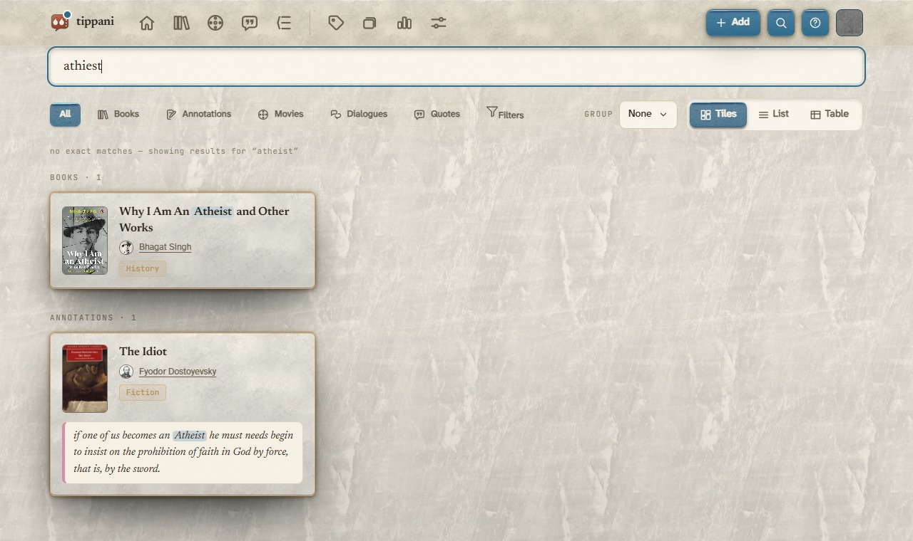
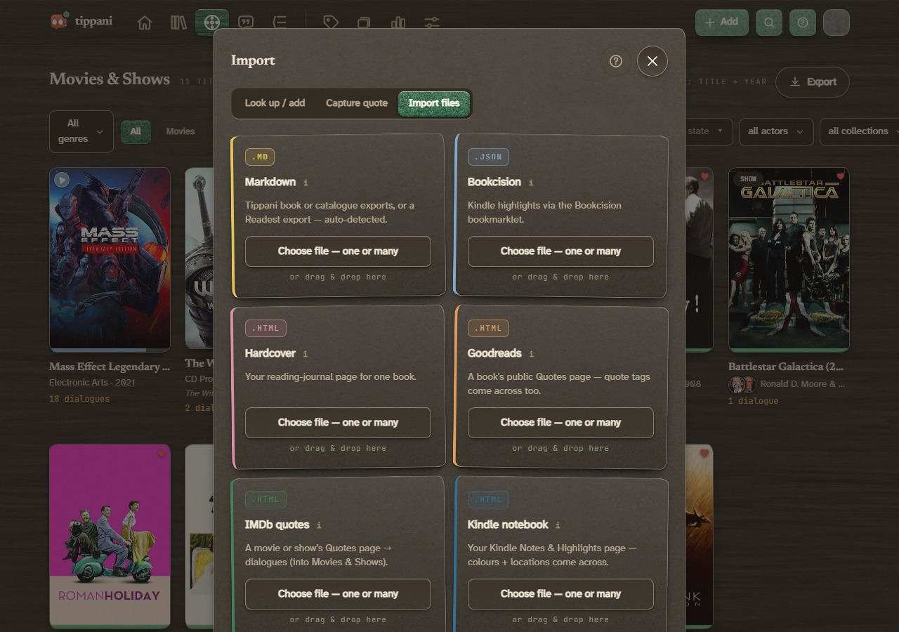

<p align="center">
  <!-- The app's own mark, from web/frontend/public/ rather than a copy under docs/img:
       the favicon, the installed app's icon and this are one drawing, and a second
       copy is a drawing that goes stale the next time the first one changes. The two
       files differ only in the terracotta — #B4482D on paper, #D8613D on dark. -->
  <picture>
    <source media="(prefers-color-scheme: dark)" srcset="web/frontend/public/mark-dark.svg">
    
  </picture>
</p>

<h1 align="center">Tippani</h1>

<p align="center"><em>ṭippaṇī · टिप्पणी · টিপ্পনী — a marginal annotation</em></p>

<p align="center">
  A self-hosted, multi-user home for your <strong>book highlights</strong>, <strong>movie dialogues</strong> and <strong>quotes from anywhere else</strong> —<br>
  paste or bulk-import quotes, tag · colour · favourite them, auto-fetch covers &amp; metadata,<br>
  search everything instantly, and export it all back out as Obsidian-friendly Markdown.
</p>

<p align="center">
  <a href="https://github.com/aaronified/tippani/releases"></a>
  <a href="https://aaronified.github.io/tippani/roadmap.html"></a>
  <a href="go.mod"></a>
  <a href="https://github.com/aaronified/tippani/pkgs/container/tippani"></a>
  
  <a href="LICENSE"></a>
</p>

<p align="center">
  🎭 <a href="https://aaronified.github.io/tippani/demo/">Interactive demo</a> — a read-only click-around with dummy data
  that tracks the current frontend (it rebuilds whenever the UI changes). Writes are disabled; everything else is
  the real interface.
</p>

<p align="center">
  🗺 <strong><a href="https://aaronified.github.io/tippani/roadmap.html">The roadmap</a></strong> — everything planned,
  every bug I already know about, and the things I have<br>
  <a href="https://aaronified.github.io/tippani/roadmap.html#aside">set aside on purpose</a>. Worth reading before you
  ask for something, and it takes requests:<br>
  <a href="https://github.com/aaronified/tippani/issues/new?template=feature_request.yml"><strong>request a feature</strong></a>
  ·
  <a href="https://github.com/aaronified/tippani/issues/new?template=bug_report.yml"><strong>report a bug</strong></a>
  — once I accept one, it lists itself on the roadmap and delists itself when it is fixed.
</p>

<p align="center">
  📓 <strong><a href="docs/PLAN.md">The design log</a></strong> — how Tippani is built and why: one entry
  per decision, each with the alternatives<br>
  considered and the trade-offs behind it. Every feature listed below has one.
</p>

---

Built for low-powered NAS boxes that already run a hundred other things: a single static Go
binary (~12 MB, `linux/amd64`), SQLite + FTS5, **~25 MB idle RSS** (the budget I hold it
within; set `GOMEMLIMIT` to cap it — the systemd unit uses 64 MiB), and **zero background jobs** (no pollers, timers, or
cron). It serves plain HTTP on port 8080 for your LAN — bring your own TLS via a reverse proxy /
Tailscale / Netbird / Twingate, or hand it a PEM pair (`TIPPANI_TLS_CERT`/`_KEY`, hot-reloaded)
and it serves HTTPS itself. No Node at runtime;
metadata lookups are on-demand and optional (nothing external is required to run); covers and
posters are served from your own disk.

**[The roadmap](https://aaronified.github.io/tippani/roadmap.html)** holds the open backlog in
priority order, the known bugs, and the
[features refused on purpose](https://aaronified.github.io/tippani/roadmap.html#aside), so the
boundaries are stated rather than left as gaps. **[`docs/PLAN.md`](docs/PLAN.md)** documents how the
app is built and why. Release history is in [`CHANGELOG.md`](CHANGELOG.md), and
[`DEVELOPMENT.md`](DEVELOPMENT.md) covers building, changing or forking it — including the
pull-request conventions and the handful of strings that still carry my name. Tippani was **written
with AI assistance**; the app itself **contains no AI** — no model calls, nothing sent anywhere.
Both halves of that are set out in [`AI.md`](AI.md).

## Screenshots

> ⚠️ Under active development — these screenshots may lag behind the current UI.

<table>
  <tr>
    <td width="38%"></td>
    <td width="38%"></td>
    <td width="24%"></td>
  </tr>
  <tr>
    <td width="38%"></td>
    <td width="38%"></td>
    <td width="24%"></td>
  </tr>
</table>

<p align="center"><sub>All four skins, one per desktop shot — Books (paper · light) · Catalogue (film · dark) · Search (film · light) · Import (paper · dark), each on a different accent. Mobile — Quotes (paper · light) &amp; the Home Daily Quiz (film · dark).</sub></p>

## Features

- 📚 **Books & annotations** — quotes and notes with six colour categories, tags, chapter and page, a
  favourite ♥ and series metadata; browse as masonry, list or sortable table, and group by series,
  author, decade or genre.
- 🎬 **Movies, shows & games** — lines with a timestamp, character and auto-filled actor. A show's
  lines carry the episode, so they read as *S2E6* and sort through the run rather than by the clock.
- 💬 **Quotes from anywhere else, on boards you make** — a speech, a letter, a song, a proverb,
  something a friend said. A board describes what it holds, so a proverb board asks which languages it
  covers and puts the translation first on the form.
- 📖 **Anthologies** — quotes gathered into a reading order with your own prose between them, drawn
  from all three kinds at once. Six switches control what each passage shows, in the reading view and
  in the Markdown export alike.
- 🎨 **Colour categories** — six highlight colours, named by you: a tag says what a quote is *about*,
  its colour says what *kind* of note it is. Renaming one changes every label in the app and nothing in
  your exports.
- 🔖 **Shelves** — *reading* · *paused* · *abandoned* · *completed*, shown as a colour bar beneath the
  cover, with progress as a percentage, a page or a season and episode, and every reread kept as its
  own dated entry.
- 🧠 **Daily Quiz & Practice** — spaced repetition across books, films and standalone quotes, each
  independently switchable. Every quote carries a memory half-life and returns along the Ebbinghaus
  forgetting curve, asked one of five ways including a server-graded fill-in-the-blank.
- 🎲 **Shuffle & on this day** — one quote at random from anywhere in your library, and whatever you
  saved on this date in earlier years. Neither affects your review schedule.
- 😴 **Skip something in the quiz without deleting it** — for a shopping list, or a reference manual
  whose highlights are all page numbers. Applied to a book, it covers every highlight you add to it
  afterwards.
- 📊 **Stats** — an activity calendar, a recall breakdown, a decade timeline and superlatives, each of
  them clickable straight through to the quotes behind it.
- 🔎 **Instant search** — full-text search across titles, people, genres, series, quotes, notes, tags
  and dialogue, returned in sections by what matched, with a typo-tolerant fallback when a search finds
  nothing.
- 🏷 **Say which field you meant** — type `tag:`, `author:`, `colour:` or any of sixteen fields and a
  dropdown offers your own library's words, narrowing as you type. Each choice becomes a chip you can
  remove.
- 🧭 **A search that knows where you are** — searching from a filtered shelf arrives filtered, and from
  a book's own page it is scoped to that book. Every chip is removable, so narrowing costs nothing.
- ☑️ **Multiselect on everything** — tick a card's corner, Ctrl-click, or press and hold on a phone,
  then set the colour, ♥, tags, a sticker or a shelf across the whole selection, or fill in missing
  metadata for all of it at once.
- 🩹 **Fill only the gaps** — fetch metadata for a selection and write only the fields that are empty,
  so a description you wrote or a cover you chose is never overwritten. *Re-verify* is the other half:
  it shows every difference and waits for you to approve the ones you want.
- 🖼 **Metadata & covers** — books from Google Books and Open Library, films and shows from TMDB and
  TheTVDB. Artwork is fetched at full resolution and served from your own disk, never hotlinked.
- 👤 **People** — authors, actors, directors, translators, editors and speakers are all real records
  with portraits, a biography and a page of their own; one person can be an author on one book and a
  translator on another.
- 📥 **Bulk import** — Tippani and Readest Markdown, Kindle Bookcision, your Kindle notebook, the
  device's own `My Clippings.txt`, saved Goodreads and Hardcover pages, and IMDb quote pages.
  Importing the same file twice adds nothing.
- 🧺 **Nothing lands until you approve it** — an import parses into a pending queue and waits there as
  long as you like. Correct a whole file at once — tags, colour, chapter, actor, or moving quotes onto
  the right work — then approve, discard, or come back to it.
- 📤 **Export** — any single work, a filtered set, your standalone quotes, or the whole library, as
  Obsidian-friendly Markdown that imports cleanly back in.
- 📨 **Share a quote** — formatted for Markdown, WhatsApp, plain text or Reddit, or rendered as an
  image in your current theme. Images are generated on your own machine and can carry the credited
  person as a portrait backdrop.
- 🏷️ **Stickers** — a heart, a star and three faces are included; upload your own transparent PNG or
  SVG and pin one to any quote as a seal the text flows around.
- 🗑️ **A thirty-day bin** — every deletion is recoverable, and comes back with its tags, colours,
  review history and cover picture intact. Keep things for 7, 30 or 90 days, or indefinitely.
- 🌐 **English and Bengali, with room for more** — both ship in the box, and neither is a fallback for
  the other. Any further language is a single file of text you can drop in and edit without rebuilding
  anything.
- 🔤 **Choose the type** — six typefaces in named roles, each previewed doing its own job, with two
  alternates each and your own uploads accepted. Bold, italic, small caps and lining figures are set
  per role, and every bundled face ships with the app.
- 🎨 **Two skins, and they are made of something** — Paper is a note lifted off a desk, Film a frame on
  a light table, each with real texture in every card, button and bar. If your system asks for higher
  contrast, the texture drops away and nothing else moves.
- 📱 **Phone-first ergonomics** — an installable PWA with a drawer, a Home screen one tap from the
  logo, quote capture one ❝ tap away, full-screen filter sheets, 44 px touch targets and no horizontal
  scrolling.
- 👌 **A long press that knows what it is on** — hold a control for its label, hold a card to select
  it, and hold the *words* of a quote for nothing at all, because that is how your phone selects text.
- ⌨️ **Keyboard shortcuts** — printed on the buttons that share their job, so nothing has to be
  memorised or looked up, and `?` lists them all. Typing is never a shortcut.
- 🧭 **A guided tour** — a walk through every feature on first run, using its own sample content rather
  than your library, and resumable from Settings whenever you stopped.
- 🔐 **Multi-user** — isolated libraries per person, and a Profile screen behind the avatar for your
  photo, name, password and account switching. Admins can add members, hand over admin, and step down.
- 📲 **Paired devices** — a one-time pairing code that a native client exchanges for a long-lived
  token, so a phone never holds your password. Changing your password signs out browsers and leaves
  paired devices alone.
- 🔗 **Real URLs** — every tab and detail view has its own address, so back and forward work and a link
  opens straight onto the view.
- 🔄 **In-app updates** — Settings checks GitHub for a newer release when you ask it to, never on its
  own. Mount the Docker socket and one click pulls and restarts; otherwise it gives you the exact
  command to run.
- 💾 **Backup & restore, encrypted** — one click builds a dated AES-256-GCM archive of your whole data
  directory, and restore puts it back in place without needing the Docker socket, from here or from a
  file taken off another Tippani server. Your password opens it on any machine, and changing your
  password does not orphan the archives this server already made.
- 🕒 **Sort by when you last read it** — the Library and Catalogue sort by the most recent date you had
  the thing in your hands, whether or not you finished it.
- 🪶 **Frugal** — one static binary, SQLite, no background jobs and no cron; built to sit quietly on a
  NAS that is already busy.

> **Roadmap** — an **Android app** that photographs a page and turns it into a highlight, with OCR
> **on the device**; more ways in (Kobo, Apple Books, Readwise and read-later imports; a PWA
> **share-target** and a page-HTML **bookmarklet**); opt-in AI summaries (OpenAI-compatible) with push
> notifications; a [Homepage](https://gethomepage.dev) dashboard widget; collections and tag shelves;
> passkeys, 2FA and per-user API tokens; an **EPUB** anthology export; and quiet, opt-in
> **achievements** — reading milestones plus one gentle spaced-repetition streak.
> See [the roadmap](https://aaronified.github.io/tippani/roadmap.html).

## Quick start (Docker Compose)

Pull the prebuilt image from GHCR (multi-arch — see the platform note below). Save this as
`docker-compose.yml`:

```yaml
services:
  tippani:
    image: ghcr.io/aaronified/tippani:latest
    container_name: tippani
    restart: unless-stopped
    ports:
      # Reachable on your LAN. First-run onboarding is unauthenticated (the first
      # visitor claims admin) — onboard promptly, or prefix with 127.0.0.1: to
      # bind host-local and front it with a reverse proxy/VPN.
      - "8080:8080"
    volumes:
      # /data holds the SQLite DB + downloaded covers. Use the named volume
      # below, OR bind-mount any host folder you already back up, e.g.:
      #   - /srv/tippani:/data
      - tippani-data:/data
    # environment:
    #   TIPPANI_COOKIE_SECURE: "1"   # when a TLS-terminating proxy is in front
    #   TIPPANI_TRUSTED_PROXY: "1"   # to trust X-Forwarded-For for the login limiter
    #   GOMAXPROCS: "1"              # NAS-friendly runtime caps (reasoning in docs/PLAN.md)
    #   GOMEMLIMIT: "64MiB"
    #   GOGC: "200"

# Only needed if you use the named volume above; delete this block when you
# bind-mount a host folder instead.
volumes:
  tippani-data:
```

Then:

```sh
docker compose up -d
```

…or grab the file and start in one go:

```sh
curl -O https://raw.githubusercontent.com/aaronified/tippani/main/docker-compose.yml
docker compose up -d
```

Open `http://<nas-ip>:8080` and **create the admin account** on the first-run onboarding screen;
the admin adds any further users from inside the app. When a TLS-terminating proxy sits in front,
set `TIPPANI_COOKIE_SECURE=1`.

> **First-run security:** onboarding is unauthenticated — whoever reaches the port first while the
> user table is empty becomes the admin. On a shared LAN, bring the stack up and create your admin
> right away (or bind host-local with `127.0.0.1:8080:8080` until you have). After that, onboarding
> closes and all routes require a login.

> **Platforms:** published as a multi-arch image — `linux/amd64` is the tested arch; `linux/arm64`
> is built and published too but is **untested**. arm64 NAS owners (Synology/QNAP/Pi): give it a
> try and report back. Neither arch is emulated to build: the binary is pure Go and cross-compiles,
> and the frontend bundle is built once on the native runner, so both images serve byte-identical
> assets. What is untested on arm64 is the binary, not the page.

## Build from source

Requires Go 1.26+ (Node only to rebuild the frontend, and only on your dev machine).

```sh
make build                         # -> bin/tippani (CGO_ENABLED=0, static)
./bin/tippani serve                # http://127.0.0.1:8080, then onboard in the browser
```

Bootstrap a user without the browser (the first user created becomes the admin):

```sh
printf '%s\n' 'a-long-password' | ./bin/tippani user add alice
```

Rebuild the frontend after changing it (re-embeds into the binary):

```sh
make frontend    # builds the SPA into web/dist
make build       # re-embed
```

## Configuration

| Env | Default | Meaning |
| :-- | :-- | :-- |
| `TIPPANI_BIND` | `127.0.0.1:8080` | Listen address (binary default). The Docker image sets `0.0.0.0:8080` so the published port is LAN-reachable; override to bind elsewhere |
| `TIPPANI_DATA` | `./data` | Data dir (SQLite DB + downloaded covers/posters) |
| `TIPPANI_TLS_CERT` | *(unset)* | Path to a PEM certificate (full chain). With `TIPPANI_TLS_KEY`, Tippani serves **HTTPS directly** — see below |
| `TIPPANI_TLS_KEY` | *(unset)* | Path to the PEM private key. Both or neither; the pair **hot-reloads** when the files change |
| `TIPPANI_COOKIE_SECURE` | `0` | Set `1` when TLS terminates in front of the app (implied automatically when the TLS pair above is set) |
| `TIPPANI_TRUSTED_PROXY` | `0` | Set `1` to trust `X-Forwarded-For` for login rate limiting |
| `TIPPANI_DOCKER_HOST` | *(unset)* | Engine API endpoint for one-click updates: `tcp://host:port` for a **docker-socket-proxy**, or `unix:///path`. Wins over the socket path below |
| `TIPPANI_DOCKER_SOCK` | `/var/run/docker.sock` | Engine API unix-socket path for one-click updates (only relevant with the socket mounted) |
| `TIPPANI_LOG_LEVEL` | `info` | Set `debug` for verbose per-operation `[trace]` logging when diagnosing an issue; errors carry lookup codes documented in [`docs/troubleshoot.md`](docs/troubleshoot.md) |

**Metadata API keys — TMDB, TheTVDB, Google Books — are configured in the app**, not via environment:
sign in → **Settings → metadata keys**, and paste a TMDB v3 key or v4 read token from
[themoviedb.org](https://www.themoviedb.org/settings/api) (TheTVDB and Google Books keys are optional —
TMDB alone covers most catalogues). Everything else works with no key.

**The published images carry built-in TMDB and TheTVDB credentials**, Jellyfin-style, so films and
shows look up with nothing configured; a key saved in Settings always wins over them, and deleting
yours falls back to the built-in rather than to nothing. Both are injected at build time (`-ldflags -X
main.defaultTMDBKey=… -X main.defaultTVDBKey=…`, from repository secrets) rather than committed, so
**a binary you build yourself has no built-in** — `make build TMDB_TOKEN=… TVDB_TOKEN=…` fills the
slots, and without them film lookup answers `503` until a key is saved. A shipped credential is not a
secret one: TMDB's is a v4 **read** token, which cannot write to the account behind it, and both
providers rate-limit per client IP so a shared credential never pools into one quota.

**TheTVDB's free key needs your PIN.** TheTVDB issues two kinds of v4 key: a paid *project* key logs
in with the key alone, while the free *user-supported* key logs in only with your **subscriber PIN**
beside it — and their dashboard shows such a key as *inactive* until a subscription backs it. Both
fields are in Settings → Metadata sources; without the PIN that kind of key is refused at login, and
results quietly come from TMDB instead (the picker now says so when that happens).

**Optional: search the web for cover art, posters and portraits.** Under **Settings → metadata keys**,
a [Programmable Search](https://programmablesearchengine.google.com/) engine id plus a Custom Search
API key turns the *search covers* and *search images* buttons into an in-app picture strip (100
searches a day are free). Without them, book covers still come from Google Books, Open Library and —
keylessly, by ISBN — Amazon's image CDN, and the people console's *search images* opens a web search
in a browser tab as it always has.

> [!CAUTION]
> **Amazon cookie (optional, use at your own risk).** Under **Settings → Amazon (advanced)** an admin
> may paste an Amazon session cookie to enrich book metadata (description + genres) by scraping the
> product page. This is **off by default and entirely optional** — book covers (keyless image CDN) and
> Kindle highlight import (a file *you* export) both work with no cookie. The cookie is stored
> write-only and never shown back, but be aware it **grants access to your Amazon account** and that
> automated scraping is **against Amazon's Conditions of Use**: the account whose cookie you supply
> bears that risk, so only you can decide to enable it. Tippani never ships, shares, or centralises the
> cookie, and only ever uses it on your own behalf.

Runtime tuning for a shared NAS (see [`deploy/tippani.service`](deploy/tippani.service)):
`GOMAXPROCS=1`, `GOMEMLIMIT=64MiB`, `GOGC=200`.

Backup: nightly `sqlite3 data/tippani.db "VACUUM INTO 'backup.db'"` from cron, off-peak — that
gives you a plain database file you can inspect. The in-app archive is the whole data directory and
is encrypted (see *Backup & restore* above); the two are complementary, not alternatives.

### Serving HTTPS directly (optional)

By default Tippani speaks plain HTTP and you terminate TLS one layer up (reverse proxy, Tailscale,
VPN). If you'd rather skip the proxy container, hand Tippani a certificate and it serves HTTPS
itself:

```yaml
    volumes:
      - tippani-data:/data
      - /srv/certs/tippani:/certs:ro     # cert.pem + key.pem, however you renew them
    environment:
      TIPPANI_TLS_CERT: /certs/cert.pem  # full chain, PEM
      TIPPANI_TLS_KEY: /certs/key.pem
```

- **Bring your own certificate.** A cert from your home CA (trusted on your devices — this is what
  makes the browser padlock, PWA install and clipboard APIs light up), a
  [`tailscale cert`](https://tailscale.com/kb/1153/enabling-https), or a wildcard your existing
  ACME tooling renews. Tippani deliberately does **not** speak ACME itself — a renewal loop is a
  background job with a third-party dependency, and Tippani ships with zero of those.
- **Renewals need no restart.** The pair re-loads on the next TLS handshake after the files change;
  a botched write keeps serving the previous pair and logs `TIP-HTTP-001` instead of dropping HTTPS.
- **Secure cookies are implied** — no need to also set `TIPPANI_COOKIE_SECURE`.
- The container healthcheck adapts automatically. A self-signed cert works too, with the usual
  browser warnings — trusted certs are what remove them.

### One-click updates through a socket proxy (optional)

The in-app update can talk to a [docker-socket-proxy](https://github.com/Tecnativa/docker-socket-proxy)
instead of the raw socket, so no socket file is ever mounted into Tippani:

```yaml
services:
  dockerproxy:
    image: tecnativa/docker-socket-proxy
    restart: unless-stopped
    environment:
      CONTAINERS: 1   # inspect self, create/start the one-shot updater
      IMAGES: 1       # pull the new image
      POST: 1         # the create/start/pull calls above are POSTs
    volumes:
      - /var/run/docker.sock:/var/run/docker.sock:ro
    networks: [tippani-internal]

  tippani:
    image: ghcr.io/aaronified/tippani:latest
    environment:
      TIPPANI_DOCKER_HOST: tcp://dockerproxy:2375
    networks: [default, tippani-internal]
    # …ports/volumes as usual; no docker.sock mount, no group_add needed

networks:
  tippani-internal:
    internal: true    # the proxy is reachable only from inside the stack
```

> [!WARNING]
> **Be honest about what this buys.** The update flow must be allowed to *create and start
> containers*, and that permission is host-root-equivalent in the wrong hands (a container can be
> created with the host filesystem mounted). The proxy still helps — no socket file in the app
> container, the exec/volumes/secrets/swarm endpoints stay blocked, and the API is only reachable
> on an internal network — but treat it as a **hardened version of the same opt-in trade-off** as
> the socket mount, not a removal of it.

## Users

The **first user** is the admin, created either by the browser onboarding screen on first run or
by the CLI when the database is still empty. The admin manages everyone else from the in-app
**Users** panel (add / remove); onboarding closes automatically once a user exists.

The CLI remains available for bootstrapping and scripting:

```sh
tippani user add <name>      # password read from stdin (first user -> admin)
tippani user passwd <name>
tippani user del <name>      # cascades to that user's books/annotations
```

Each user has a fully isolated library — a security property, not a layout choice; the
reasoning is in [docs/PLAN.md](docs/PLAN.md#2-ownership-authentication-and-exposure).
Passwords change in-app via `POST /auth/password`.

## Layout

A map of the tree — every package, script and workflow, what each one is for, and which
file holds which rule — is in **[DEVELOPMENT.md](DEVELOPMENT.md#where-things-live)**. It
lives there once rather than in both places, because two maps of the same tree disagree
eventually and the copy nobody edits is the one people read.

That file also covers forking this as your own, including renaming the module path.

## Attribution

Book metadata comes from [Google Books](https://books.google.com/) and
[Open Library](https://openlibrary.org/); book covers and author images from
[Amazon](https://www.amazon.com/). All movie and show metadata and posters come from the
[TMDB](https://www.themoviedb.org/) and [TheTVDB](https://thetvdb.com/) APIs — this product uses
the TMDB and TheTVDB APIs but is not endorsed or certified by either. Author/actor reference
links resolve through Open Library, TMDB, and [Wikidata](https://www.wikidata.org/) (for the
Wikipedia hop), and link out to IMDb, TMDB, TheTVDB, Wikipedia, and Open Library.

Standing on the shoulders of:

- **[pretext](https://github.com/chenglou/pretext)** — the text-reflow calculation that lets a quote wrap naturally around a pinned
  sticker (the `FlowQuote` seal).
- **[CC0 Textures](https://cc0-textures.com/)** — the public-domain (CC0) texture packs behind the
  paper·wood·metal·glass surfaces of the paper/film skins.
- **[Bookcision](https://bookcision.readwise.io/)** and **[Readest](https://github.com/readest/readest)** — I read their highlight / Markdown exports directly as import
  sources; thanks to both apps for making Kindle and cross-device highlights portable.
- **[Fontsource](https://fontsource.org/)**, and the type designers behind the eighteen families
  that ship in the build — Newsreader, Source Serif 4, Literata, Hanken Grotesk, Inter, Public Sans,
  IBM Plex Mono, JetBrains Mono, Source Code Pro, Caveat, Kalam, Gloria Hallelujah, Noto Serif
  Bengali, Hind Siliguri, Tiro Bangla, Noto Serif Devanagari, Hind and Tiro Devanagari Hindi. Every
  one is under the **SIL Open Font License 1.1**, and every one is bundled rather than fetched.

## License

MIT — see [`LICENSE`](LICENSE). On how the code was written, see [`AI.md`](AI.md).
